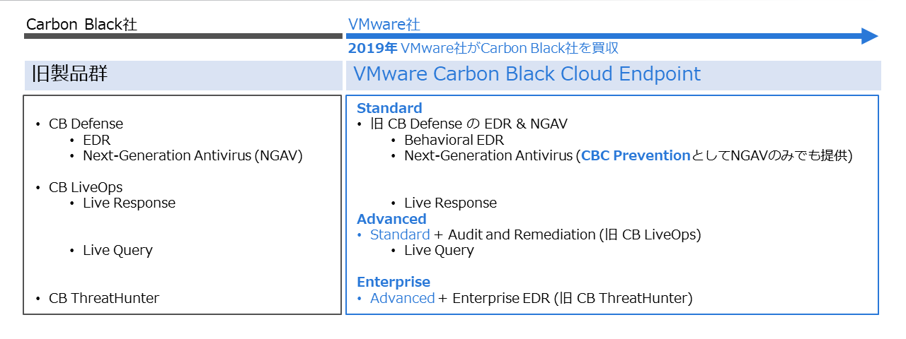
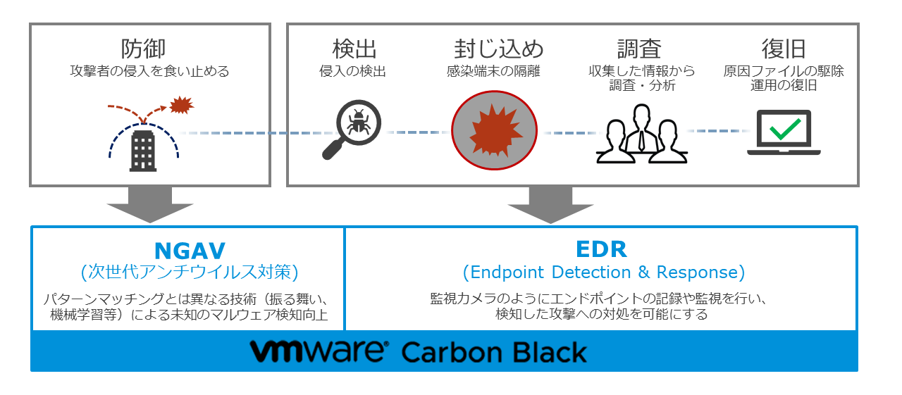

# はじめに

VMware Carbon Black Cloud EndpointはVMware社が提供するフルクラウドモデルのエンドポイントセキュリティ製品で、強力なEndpoint Detection and Response(以下、EDR)機能を使用できることが特徴です。

2019年にVMware社がCarbon Black社を買収し、VMware社がセキュリティ領域に本格参入することになりました。Carbon Black社はEDRを最初にセキュリティ市場に投入したベンダーであり、EDRの生みの親として広く知られています。

VMware Carbon Black Cloud EndpointのStandardエディションは、Carbon Black社時代にはCB Defenseという製品名で広く導入された製品で、VMware社による買収後VMware Carbon Black Cloud EndpointのStandardエディションに名称変更し提供開始されました。

EDRを日本語に翻訳すると「エンドポイントでの検知と対応」となります。
ここでのエンドポイントとしては、PCやサーバー、スマートデバイスなどが挙げられます。これらの保護対象において、多様なサイバー攻撃による侵害を検知してその対応を適切に実施するための製品がEDRです。

EDR登場の背景には近年のサイバー攻撃の高度化が理由として挙げられます。従来のエンドポイントセキュリティ製品としては、アンチウイルス(以下、AV)、次世代アンチウイルス(以下、NGAV)、エンドポイントプロテクションプラットフォーム(以下、EPP)などがメジャーでした。これらの製品はサイバー攻撃の手法の中でもマルウェアを使用した攻撃に対して効果的な防御を提供するものです。
EPPにおいてはAVやNGAVのようなアンチマルウェアな防御機能にとどまらず、ファイアウォールや侵入防御(IPS)といった異なるサイバー攻撃手法を防御することに長けた機能が含まれている製品もあります。

これらの製品はサイバー攻撃による侵害を防ぐことを目的としていますが、近年ではサイバー攻撃の手法が高度に進化しています。

従来のエンドポイントセキュリティ製品では、次のようなサイバー攻撃への対応が難しくなっています。
- 大量の亜種生成、難読化、サンドボックス回避といった高度なマルウェア
- ゼロデイ脆弱性を狙った迅速なマルウェア生成
- ファイルレスマルウェア
- OS標準ツールの悪用

サイバー攻撃の進化の理由には、組織的な攻撃者集団の存在や、サイバー攻撃自体が一つのビジネスとなりその市場規模が拡大していることも要因に挙げられます。

つまり、従来の「防ぎきることを目的とした対策」を補完する役割として登場したのがEDRです。
未知の脅威による被害は避けられないものとして、被害を最小限に抑えつつ迅速な復旧を可能にする対策としてEDRが重要視されています。

Carbon Black Cloud EndpointはEDR製品ですが、防御機能としてNGAVも提供されます。パターンマッチングではなくその振る舞いを検知して悪意ある攻撃の動作をブロックすることで、次のようなマルウエアへの対策が可能です。
- 既知のマルウェア
- 未知のマルウェア
- ファイルレス攻撃
- 既存ツールを悪用した攻撃

EDRによって全ての攻撃に対して調査や対応を行うとなると、その工数は膨大なものとなります。
そこで、既知の脅威においてはNGAVによってあらかじめ防御することで、未知の脅威への対応に集中できるようになります。

## 1.1. 本書について

本書はCarbon Black Cloud Endpoint Standardエディションの導入手引書となります。
製品を購入してから実際に利用するまでに必要な、さまざまな情報を解説しています。Carbon Black Cloudコンソールへの初回ログイン、センサーのインストール方法、各種設定の解説、擬似的な攻撃を再現したアラートへの対応例など、一連の流れを理解することで、製品を実際に利用開始するための知識を習得することが目的です。

## 1.2. 本書の対象者

本書はCarbon Black Cloud Endpointの初学者向けに、初めてCarbon Black Cloud Endpointを操作する人であっても、本書を参考にすることで製品機能を体感できるよう作成しています。
前提として必要となる予備知識などは特にありませんが、本書で管理対象としているOSのWindows 10や、エンドポイントセキュリティ製品としてEDR製品と領域の近いEPP製品について知識がある場合、よりスムーズな理解が得られることが見込まれます。

## 1.3. 本書で利用した環境

| 項目                  | バージョン                               |
|-----------------------|------------------------------------------|
| Windows 10 Enterprise | 21H1                                     |
| CBセンサー            | 3.7.0.1503                               |
| CBCコンソール         | https://defense-prodnrt.conferdeploy.net |

## 1.4. 略称、用語、凡例について

本書で使用されている略称、用語、凡例について記載します。

### 1.4.1. 略称

| 名称                          | 略称 |
|-------------------------------|------|
| Carbon Black                  | CB   |
| Carbon Black Cloud            | CBC  |
| Carbon Black Cloud Endpoint   | CBCE |
| Antivirus                     | AV   |
| Next-Generation Antivirus     | NGAV |
| Endpoint Protection Platform  | EPP  |
| Endpoint Detection & Response | EDR  |

### 1.4.2. 用語

| 用語 | 説明 |
| ---- | ----|
| エンドポイント | Carbon Black Cloudの保護対象となるデバイス。 本書では保護対象デバイスとしてMicrosoft Windows 10が動作するPCを想定している。 | 
| CBセンサー |  Carbon Black Cloudのエージェントソフトウェア、エンドポイントに対してインストールすることで各種機能を提供する。 | 
| CBCコンソール | Webブラウザを使用してインターネット経由でアクセスするCarbon Black Cloudの管理ポータルサイト。 |
| CBCバックエンド |  エンドポイントに対して、Carbon Black Cloudサービスのクラウド側の機能や設備を指す表現として使用する。 | 
| レピュテーション | アプリケーションの信頼度を11段階で表してもので、NGAV機能におけるポリシーの設定に関連する。 | 

### 1.4.3. 凡例

| 表記 | 説明 |
| ---- | ----|
|  | 赤実線で囲まれた部分が操作の対象であることを示す。 |
|  | 赤点線で囲まれた部分が確認の対象であることを示す。 |
