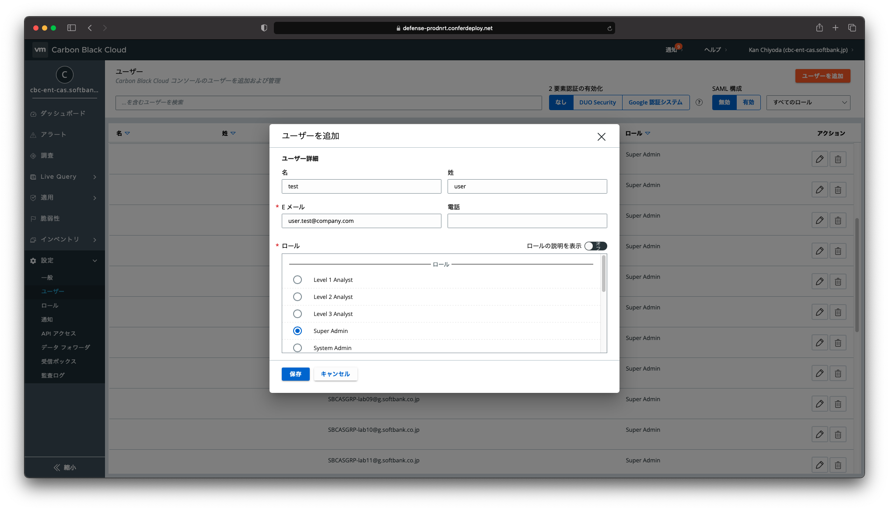

# 2. Carbon Black Cloudコンソールへのログイン

CBCの管理コンソールはCarbon Black Cloudコンソールと呼ばれます。

本章では、製品購入後のCarbon Black Cloudコンソールへの初回ログイン方法や管理ユーザーの設定について説明します。
CBCはフルクラウドモデルの製品であり、全ての管理はクラウドから実施します。

* 管理者はクラウドの管理コンソールにログインして設定などを行います。
* 保護対象のエンドポイントがクラウドへアクセスすることで管理コンソールから環境を一元管理します。

このようにCBCの管理は全てクラウドにて行うため、管理サーバをオンプレミスに構築する必要などはありません。

## 2.1. Carbon Black Cloudコンソール初回ログイン

CBCEを購入するとVMware社よりログイン情報がメール送付されるので、その情報をもとに初回ログインします。

WIP:[手順：Carbon Black Cloudコンソールへの初回ログイン]
<!-- (walkthroughs/02-01_cbc-console-login.md)) -->

## 2.2. 管理ユーザーの設定

CBCで管理ユーザーの設定や追加を行うには「設定」\>「ユーザー」へ画面遷移し、「ユーザーを追加」をクリックします。

ユーザーを追加する場合、「Eメールアドレス」と「ロール」の設定が必須です。ここで設定したEメールアドレスへアクティベーションメールが送信されるため、実際にEメールを受信可能なメールアドレスを入力してください。

※管理ユーザーの追加が可能なロールは事前定義済みロールの内では「Super Admin」か「System Admin」である必要があります。

参考資料：
- ユーザーロールについて  
  https://docs.vmware.com/jp/VMware-Carbon-Black-Cloud/services/carbon-black-cloud-user-guide/GUID-CF5ACD2C-A534-46C8-AE06-E1884DB37B58.html

## 2.3. ロールの設定

CBCコンソールの全ての管理ユーザーはそれぞれの権限を持つロールが割り当てられます。ロールはあらかじめ用意されているものをユーザーへ割り当てることも可能ですが、カスタムロールを作成してユーザーへ割り当てることも可能です。

あらかじめ用意されているロールは「事前定義済みロール」と「レガシーロール」に分類されます。レガシーロールは現在のところ選択できますが、今後使用できなくなりますのでご注意ください。事前定義済みロールには6つの組み込みロールが用意されています。

- Level 1 Analyst
- Level 2 Analyst
- Level 3 Analyst
- Super Admin
- System Admin
- View All

事前定義済みロールについて詳しく知りたい場合には以下のリンクを参照ください。

参考資料：
- 事前定義済みユーザー ロール  
  https://docs.vmware.com/jp/VMware-Carbon-Black-Cloud/services/carbon-black-cloud-user-guide/GUID-26AD8342-70EC-43A3-923E-8F21C051CAF2.html

カスタムロールの作成では任意の権限を付与したロールの作成が可能です。管理ユーザーに割り当てるロールはオペレーションに必要な最小限の権限が付与されていることが望ましいため、事前定義済みロールに適したロールがない場合にはカスタムロールを作成して適用します。

カスタムロールの作成では「設定」\>「ロール」へ画面遷移し、「ロールの追加」をクリックします。

ロールの追加では「ロール名」、「説明」、「許可」の項目を設定します。「許可のコピー元」を選択することで、ベースとなる許可の権限を他のロールからコピーすることが可能です。全ての設定が完了したら「保存」をクリックします。

参考資料：
- カスタムロールの追加または編集  
  https://docs.vmware.com/jp/VMware-Carbon-Black-Cloud/services/carbon-black-cloud-user-guide/GUID-2E02B16B-185E-434F-83C9-DD1F8ECBFDB7.html
- カスタムロールの削除  
  https://docs.vmware.com/jp/VMware-Carbon-Black-Cloud/services/carbon-black-cloud-user-guide/GUID-69E4C965-7468-42DD-983A-EE6650C01F94.html
  