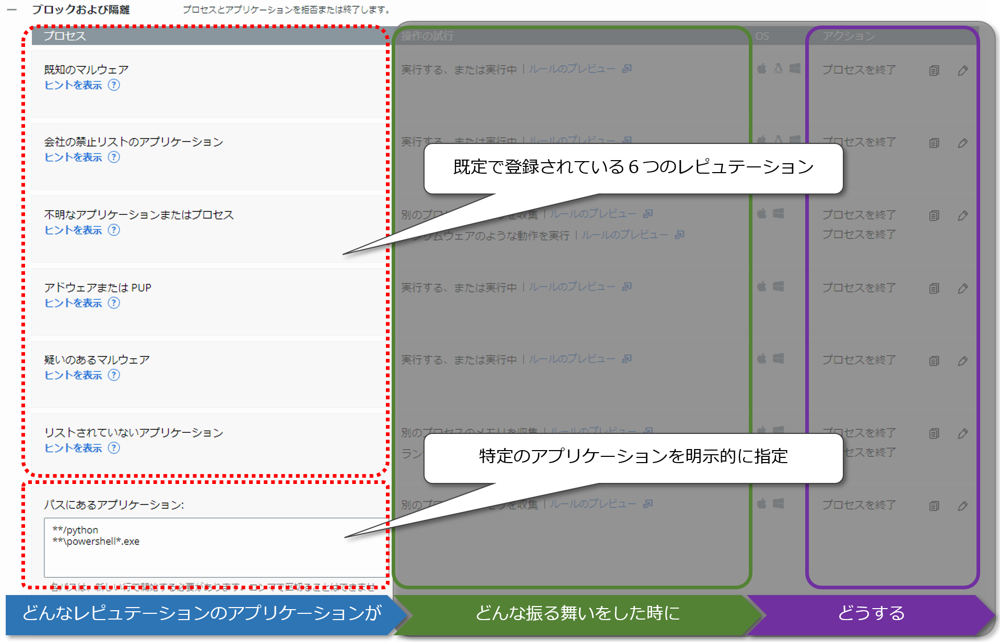
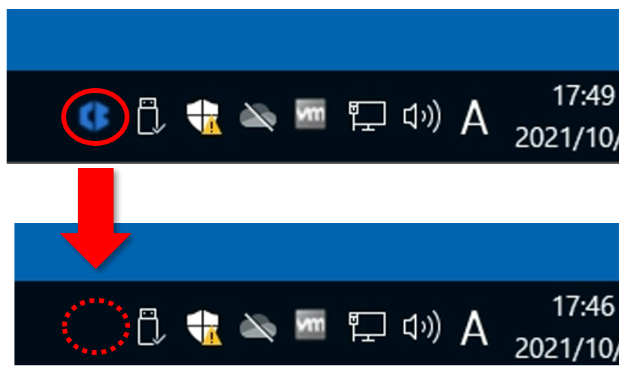

## 3.1. ポリシー

センサーにポリシーを適用することで、各エンドポイントにインストールされたセンサーの設定をグループ化して一元管理することができます。

### 3.1.1. 事前定義済みポリシー

CBCでは、一般的な用途を想定した3つの事前定義済みポリシーが予め用意されています。

| 事前定義済みポリシー | 用途に関する説明 |
| --- | --- |
| Monitored | 防御機能を無効化して、監視機能のみを利用したい場合に有用。 |
| Standard | 標準的なポリシーで、既定値のまま本番環境で利用可能。 |
| Advanced | 非常に積極的な防御ポリシーであり、過検知が発生する可能性もあるため、いきなり本番環境で利用することは非推奨。 |

これらの事前定義済みポリシーは、そのままセンサーに適用して利用することも可能ですが、事前定義済みポリシーの設定を不用意に変更してしまうと、事前定義されたコンセプトとは異なる内容が反映されてしまう可能性があります。したがって、実際に使用する際には、事前定義済みポリシーをテンプレートとして、オリジナルのポリシーを作成することを推奨します。

なお、センサーのインストール時には、既定でStandardポリシーが適用されますが、センサーインストール後に適用するポリシーを変更することが可能です。また、後述するUnattended installを使用してセンサーをインストールすれば、センサーインストール時に適用するポリシーを指定することも可能になります。

参考資料：
- 事前定義済みポリシー  
https://docs.vmware.com/jp/VMware-Carbon-Black-Cloud/services/carbon-black-cloud-user-guide/GUID-E1E13CC9-7BC0-4811-9EC3-0A29481B1011.html

### 3.1.2. ポリシーの設定項目

CBCコンソールでは、ポリシーの設定項目は、4つのタブに分類されています。

管理ユーザーは、これら4つのタブを使用して、ポリシーを作成することができます。

各項目の設定内容は以下の通りです。

| 項目             | 設定内容                                                   |
|------------------|------------------------------------------------------------|
| 一般             | ポリシー名等のポリシーに関する設定                         |
| 防止             | アプリケーションの許可／ブロック等の防御ルールに関する設定 |
| ローカルスキャン | シグネチャ更新等のローカルスキャンに関する設定             |
| センサー         | バックグラウンドスキャン等のセンサーに関する設定           |

事項からは、各項目の設定内容の詳細について記載します。

#### 3.1.2.1. 一般設定

\[一般\]タブでは、ポリシーに関する設定を行います。

一般設定に関する各項目の設定内容は以下の通りです。

<table>
    <colgroup>
    <col style="width: 23%" />
    <col style="width: 76%" />
    </colgroup>
    <thead>
        <tr class="header">
            <th>項目</th>
            <th>説明</th>
        </tr>
    </thead>
    <tbody>
        <tr class="odd">
            <td>ポリシー名（必須）</td>
            <td>一意のポリシー名を設定する。</td>
        </tr>
        <tr class="even">
            <td>ポリシーの説明</td>
            <td>ポリシーに関する説明を入力する。</td>
        </tr>
        <tr class="odd">
            <td>ターゲットの値</td>
            <td>
                
ポリシーに関連付ける、ターゲット バリューを「低」、「中」、「高」、「Critical」から選択する。

                
ターゲット バリューとは、アラートの脅威レベルを計算する際の乗数として機能する値で、例えば、ターゲット バリューを「高」に設定すると、同じ状況下で発生したアラートでも、そのポリシーが適用されるセンサーについてのみ、アラートの脅威レベルを明示的に増加させることができる。

                
・低：アラートの脅威レベルを低下させる

                
・中：基準値でアラートの脅威レベルに乗数は追加されない

                
・高／Critical：アラートの脅威レベルを増加させる

            </td>
        </tr>
    </tbody>
</table>

参考資料：
- 一般的なポリシー設定  
  https://docs.vmware.com/jp/VMware-Carbon-Black-Cloud/services/carbon-black-cloud-user-guide/GUID-5A4E7732-22E6-4C59-94A2-6979F341A783.html
- アラートおよびレポートの重要度／ターゲット バリュー  
  https://docs.vmware.com/jp/VMware-Carbon-Black-Cloud/services/carbon-black-cloud-user-guide/GUID-95388BA8-00FA-432C-ABC0-7C3353D19D35.html

#### 3.1.2.2. 防止設定

\[防止\]タブは、4つの項目に分類されており、項目毎にルールを作成することが可能です。

防止設定に関する各項目の設定内容は以下の通りです。

| 項目 | 説明 |
| --- | --- |
| 許可 | 特定のアプリケーションの振る舞いを許可する。
| ブロックおよび隔離 | レピュテーションに基づき振る舞いを拒否、プロセスを強制終了する。 特定のアプリケーションの振る舞いを拒否、プロセスを強制終了する。|
| USB デバイスのブロック | 未承認のUSBデバイスへのアクセスをブロックする。 |
| アップロード | センサーがエンドポイントの特定のパスからアップロードを送信することを拒否または許可する。 ※この機能については本書では取り扱いません。 |

参考資料：
- 防止ポリシー ルールの作成／アップロード パス  
  https://docs.vmware.com/jp/VMware-Carbon-Black-Cloud/services/carbon-black-cloud-user-guide/GUID-45290F5F-38AB-42EF-8131-554E0D51B910.html

##### ■\[許可\]ルール

\[許可\]ルールを作成することで、特定のアプリケーションによる特定の振る舞いを許可したり、許可した振る舞いに関するログの取得を行うことが可能です。また、全ての振る舞いを許可（バイパス）することも可能です。

\[許可\]ルールは、後述する\[ブロックおよび隔離\]ルールよりも優先されるため、予め許可したいアプリケーションを登録しておくことで、\[ブロックおよび隔離\]ルールによる過検知を抑止することができます。

例えば、他社製のアンチウィルスソフトとCBCが共存している環境においては、アンチウィルスソフトのインストールパスを、予めバイパスに設定しておくことで、CBCからアンチウィルスソフトへの干渉を防ぐことができます。

\[プロセス\]欄では、\[許可\]ルールの対象となるアプリケーションがインストールされているフォルダや、関連するファイルのパスを指定します。

パスの指定には、ワイルドカードを使用することも可能です。

| ワイルドカード | 説明 |
| --- | --- |
| \*\* | そのディレクトリ配下および、サブディレクトリとその配下を含む全ファイル。 |
| \*   | そのディレクトリ配下の全ファイル。 |
| ?    | その位置にある0文字 or 1文字。 |

参考資料：
- 防止ポリシー ルールの作成／パスでのワイルドカードの使用  
  https://docs.vmware.com/jp/VMware-Carbon-Black-Cloud/services/carbon-black-cloud-user-guide/GUID-45290F5F-38AB-42EF-8131-554E0D51B910.html
- Carbon Black Cloud: How to Use Wildcards in Policy Rules  
  https://community.carbonblack.com/t5/Knowledge-Base/Carbon-Black-Cloud-How-to-Use-Wildcards-in-Policy-Rules/ta-p/62555

\[操作の試行\]欄では、制御対象となるアプリケーションの振る舞いを選択します。

<table>
    <colgroup>
        <col style="width: 39%" />
        <col style="width: 60%" />
    </colgroup>
    <thead>
        <tr class="header">
            <th>操作の試行</th>
            <th>説明</th>
        </tr>
    </thead>
    <tbody>
        <tr class="odd">
            <td>任意の操作を実行する</td>
            <td>全ての[操作の試行]を対象範囲とした任意の操作。後述するバイパス アクションと組み合わせたルールは、子プロセスにも継承されるため、使用時には慎重に検討が必要である。</td>
        </tr>
        <tr class="even">
            <td>任意の API 操作を実行する</td>
            <td>
                
APIカテゴリに分類される以下の操作。

                
・別のプロセスのメモリを収集

                
・メモリからコードを実行

                
・コードを挿入するか、別のプロセスのメモリを変更

                
・ランサムウェアのような動作を実行に含まれる、MBRへの書き込み操作

            </td>
        </tr>
        <tr class="odd">
            <td>実行する、または実行中</td>
            <td>アプリケーションを実行する操作、実行中のプロセス。</td>
        </tr>
        <tr class="even">
            <td>ネットワークを介して通信</td>
            <td>ネットワークを介して通信する操作。</td>
        </tr>
        <tr class="odd">
            <td>別のプロセスのメモリを収集</td>
            <td>別のプロセスのメモリ領域へのアクセスやプロセス情報の取得等の操作。</td>
        </tr>
        <tr class="even">
            <td>メモリからコードを実行</td>
            <td>バッファオーバーフローによるコードの実行等の操作。</td>
        </tr>
        <tr class="odd">
            <td>コマンド インタープリターを起動</td>
            <td>コマンド インタープリター（cmd.exe、powershell.exe、cscript.exe、wscript.exe、wmic.exe、mshta.exe、python等）を子プロセスとして起動する操作。</td>
        </tr>
        <tr class="even">
            <td>ランサムウェアのような動作を実行</td>
            <td>隠しファイルの変更、シャドウコピーやMBRへの書き込み等の操作。</td>
        </tr>
        <tr class="odd">
            <td>ファイルレス スクリプトを実行</td>
            <td>スクリプト インタープリター（powershell.exe、python等）をディスク上に存在しない(メモリ上に展開された)スクリプトから動作させる操作。</td>
        </tr>
        <tr class="even">
            <td>コードを挿入するか、別のプロセスのメモリを変更</td>
            <td>別のプロセスのメモリ領域へのコードの挿入やメモリ変更等の操作。</td>
        </tr>
    </tbody>
</table>

参考資料：
- Carbon Black Cloud: What are the differences between API Bypass and Full Bypass  
  https://community.carbonblack.com/t5/Knowledge-Base/Carbon-Black-Cloud-What-are-the-differences-between-API-Bypass/ta-p/75758
- TTP リファレンス  
  https://docs.vmware.com/jp/VMware-Carbon-Black-Cloud/services/carbon-black-cloud-user-guide/GUID-E68E7554-3183-4E07-A0D6-07061C0E6E32.html

\[アクション\]欄では、制御対象となるアプリケーションの振る舞いに対する制御方法を指定します。

| アクション | 説明 |
|-----------|------|
| 許可           | \[操作の試行\]で指定された操作を許可する。操作ログは記録されず、ログデータはバックエンドに送信されない。 |
| 許可およびログ | \[操作の試行\]で指定された操作を許可する。操作ログが記録されて、ログデータがバックエンドに送信される。   |
| バイパス       | 全ての操作を許可する。何もログに記録されず、ログデータはバックエンドに送信されない。 |

参考資料：
- Endpoint Standard: What Is The Difference Between Allow, Allow & Log and Bypass?  
  https://community.carbonblack.com/t5/Knowledge-Base/Endpoint-Standard-What-Is-The-Difference-Between-Allow-Allow-Log/ta-p/65872

以下の設定例では、全ドライブのどこかに存在する3rdPartyAV.exeという実行ファイルに関して、全ての操作を許可し、ログの記録も行いません。したがって、CBCバックエンドにも3rdPartyAV.exeのアクティビティに関するデータは送信されません。

また、以下の設定例では、C:\companyAppフォルダおよび、そのサブフォルダ配下のアプリケーションの実行とネットワーク通信のみを許可しています。実行とネットワーク通信については、ログの記録も行わず、CBCバックエンドにもデータは送信されませんが、それ以外の操作の試行については、許可の対象外となります。

> [参考 1：他社アンチウイルスのスキャン対象からCBCセンサーを除外するには](tips/tips_01.md)

##### ■\[ブロックおよび隔離\]ルール

\[ブロックおよび隔離\]ルールを作成することで、アプリケーションのレピュテーションと振る舞いに基づき、プロセスを終了したり、操作の試行を拒否することが可能になります。

\[プロセス\]欄の6つのレピュテーションに該当するアプリケーションが、\[ブロックおよび隔離\]ルールの評価対象になります。

また、\[許可\]ルールと同様に、ルールの対象となるアプリケーションがインストールされているフォルダや、関連するファイルのパスを指定することで、特定のアプリケーションを評価の対象として指定することも可能です。

パス指定の際には、\[許可\]ルールと同様にワイルドカードを利用することができます。

| ワイルドカード | 説明                                                                     |
|----------------|--------------------------------------------------------------------------|
| \*\*           | そのディレクトリ配下および、サブディレクトリとその配下を含む全ファイル。 |
| \*             | そのディレクトリ配下の全ファイル。                                       |
| ?              | その位置にある0文字 or 1文字。                                           |

ポリシーを作成する際に、テンプレートとして選択する事前定義ポリシーの種類によっては、既に特定のアプリケーションが \[ブロックおよび隔離\]ルールの評価対象として指定されている場合があります。これは、選択する事前定義ポリシーの厳格度に影響されます。

Monitoredポリシーでは、「防御機能は一切無効にして監視のみを行うこと」をコンセプトとしているため、\[ブロックおよび隔離\]対象として特定のアプリケーションは指定されていません。

Standardポリシーと更に高い厳格度を要求するAdvancedポリシーにおいては、そのコンセプトに比例して、特定のアプリケーションに対しても、より厳格な制限が適用されます。

参考資料：
- Understanding & Hardening the Prevention Standard Policy  
https://community.carbonblack.com/t5/Prevention-Documents/Understanding-amp-Hardening-the-Prevention-Standard-Policy/ta-p/101847

\[操作の試行\]欄では、制御対象となるアプリケーションの振る舞いを選択します。

指定可能な\[操作の試行\]は、概ね\[許可\]ルールの場合と同様ですが、レピュテーションに基づく評価が介在する「信頼されていないプロセスを起動」が追加されています。

| 操作の試行 | 説明 |
| --------- | ---- |
| 実行する、または実行中 | アプリケーションを実行する操作、実行中のプロセス。 |
| ネットワークを介して通信 | ネットワークを介して通信する操作。 |
| 別のプロセスのメモリを収集 | 別のプロセスのメモリ領域へのアクセスやプロセス情報の取得等の操作。 |
| メモリからコードを実行 | バッファオーバーフローによるコードの実行等の操作。 |
| 信頼されていないプロセスを起動 | レビュテーションがNOT_LISTED（センサーがレピュテーションリクエストを送信したがCBCバックエンドに情報が無い）とUNKNOWN（未だセンサーがレピュテーションリクエストを送信していない）のプロセスを子プロセスとして起動する操作。 |
| コマンド インタープリターを起動 | コマンド インタープリター（cmd.exe、powershell.exe、cscript.exe、wscript.exe、wmic.exe、mshta.exe、python等）を子プロセスとして起動する操作。 |
| ランサムウェアのような動作を実行 | 隠しファイルの変更、シャドウコピーやMBRへの書き込み等の操作。 |
| ファイルレス スクリプトを実行 | スクリプト インタープリター（powershell.exe、python等）をディスク上に存在しない(メモリ上に展開された)スクリプトから動作させる操作。 |
| コードを挿入するか、別のプロセスのメモリを変更 | 別のプロセスのメモリ領域へのコードの挿入やメモリ変更等の操作。 |

参考資料：
- Endpoint Standard: Reputation Priority  
  https://community.carbonblack.com/t5/Knowledge-Base/Endpoint-Standard-Reputation-Priority/ta-p/51797
- レピュテーションのリファレンス  
  https://docs.vmware.com/jp/VMware-Carbon-Black-Cloud/services/carbon-black-cloud-user-guide/GUID-DD155BF4-1C8F-4104-83E6-305AC559674C.html

ポリシーを作成する際に、テンプレートとして選択する事前定義ポリシーの種類によって、\[操作の試行\]の既定値が異なります。

Monitoredポリシーでは、「防御機能は一切無効にして監視のみを行うこと」をコンセプトとしているため、\[操作の試行\]は何も指定されていません。

Standardポリシーと更に高い厳格度が要求されるAdvancedポリシーにおいては、そのコンセプトに比例して、\[操作の試行\]に対しても、より厳格な制限が適用されます。

\[アクション\]欄では、制御対象となるアプリケーションの振る舞いに対する制御方法を指定します。

指定可能な\[アクション\]は、\[許可\]ルールの場合とは異なり、\[拒否\]や\[プロセス終了\]といった\[操作の試行\]対して否定的なアクションになります。

| アクション     | 説明 |
| ------------- | ---- |
| 操作を拒否     | \[操作の試行\]で指定された操作を検知した場合、その操作のみを拒否する。 |
| プロセスを終了 | \[操作の試行\]で指定された操作を検知した場合、そのプロセスを強制終了する。 |

参考資料：
- CB Defense: What Is The Difference Between Deny Operation and Terminate Process  
https://community.carbonblack.com/t5/Knowledge-Base/CB-Defense-What-Is-The-Difference-Between-Deny-Operation-and/ta-p/65827

以下の設定例では、レピュテーションが\[既知のマルウェア\]に該当するアプリケーションのプロセスが実行中であることを検知した場合（実行しようとした場合も含む）、そのプロセスを直ちに強制終了します。

また、以下の設定例では、C:\companyAppフォルダおよび、そのサブフォルダ配下にインストールされたアプリケーションのプロセスが、ネットワークを介して通信を試行した場合には、操作を拒否し、別のプロセスのメモリを収集を試行した場合には、プロセスを強制終了します。

##### ■\[USBデバイスのブロック\]ルール

\[USBデバイスのブロック\]を有効にすることで、未承認のUSBストレージ デバイスがエンドポイントに接続された場合に、そのUSBストレージ デバイスへのアクセスをブロックすることができます。

また、この設定内容については、既に作成済みの他のポリシーにコピーすることもできます。

なお、USBストレージ デバイスの承認操作については、\[インベントリ\] - \[USBデバイス\]で実施することができます。

参考資料：
- 防止ポリシー ルールの作成／USB デバイスのブロック  
  https://docs.vmware.com/jp/VMware-Carbon-Black-Cloud/services/carbon-black-cloud-user-guide/GUID-45290F5F-38AB-42EF-8131-554E0D51B910.html
- USB デバイス  
  https://docs.vmware.com/jp/VMware-Carbon-Black-Cloud/services/carbon-black-cloud-user-guide/GUID-19B3084E-7092-494C-8484-5B333F423135.html

##### ■\[アップロード\]ルール

※この機能については本書では取り扱わないため、省略します。

参考資料：
- 防止ポリシー ルールの作成  
  https://docs.vmware.com/jp/VMware-Carbon-Black-Cloud/services/carbon-black-cloud-user-guide/GUID-45290F5F-38AB-42EF-8131-554E0D51B910.html

#### 3.1.2.3. ローカルスキャン設定

\[ローカルスキャン\]タブでは、ローカルスキャンに関する設定を行います。

ローカルスキャンとは、CBCからエンドポイントのローカルドライブにダウンロードしたシグネチャを使用して、ファイル レピュテーションを決定する機能です。詳細は「3.3.レピュテーション」に記載しますが、この時に使用されるレビュテーションは、CBCのクラウドバックエンドが使用するレピュテーションとは異なるレピュテーションになります。

例えば、エンドポイントにおいて、新規にインストールされたアプリケーションが実行された際に、一時的にインターネットに接続できない等の理由から、CBCのクラウドバックエンドからレピュテーションを取得できなかったとします。

この場合、新規アプリケーションのレピュテーションは、暫定的に「UNKNOWN」として評価されますので、前項に記載した\[許可\]ルールや、\[ブロックおよび隔離\]ルールも「UNKNOWN」として評価されたアプリケーションに対するアクションが適用されます。

もし、ローカルスキャンが有効であれば、一時的にインターネットに接続できない状況であったとしても、暫定的な「UNKOWN」ではなく、予めダウンロードしておいたシグネチャを使用して、正しいレピュテーションで新規アプリケーションを評価することが可能となります。

もちろん、ダウンロード済みのシグネチャに新規アプリケーションのレピュテーションが存在しない場合には、「UNKNOWN」として評価されますが、シグネチャにレピュテーションが存在するアプリケーションであれば、エンドポイントがオフライン状態であったとしても、正しいレピュテーションに基づいてポリシーを評価することが可能になる点が、ローカルスキャンを有効化するメリットであると言えます。

ローカルスキャンに関する各項目の設定内容は以下の通りです。

<table>
    <colgroup>
        <col style="width: 18%" />
        <col style="width: 27%" />
        <col style="width: 53%" />
    </colgroup>
    <thead>
        <tr class="header">
            <th colspan="2">項目</th>
            <th>説明</th>
        </tr>
    </thead>
    <tbody>
        <tr class="odd">
            <td>スキャナの構成</td>
            <td>オンアクセス ファイル スキャン モード</td>
            <td>
                
・無効：ファイルをスキャンしない。

                
・標準：新しいファイルの初回実行時にスキャンする。CBセンサー導入前より存在する古いファイルはスキャンしない。

                
・積極的：全てのファイルの初回実行時にスキャンする。

            </td>
        </tr>
    </tbody>
</table>

参考資料：
- ローカル スキャン設定  
https://docs.vmware.com/jp/VMware-Carbon-Black-Cloud/services/carbon-black-cloud-user-guide/GUID-E99C6B6D-C116-4561-8F4B-B09FDA4B7985.html
- Endpoint Standard: How To Configure Local AV Scan  
  https://community.carbonblack.com/t5/Knowledge-Base/Endpoint-Standard-How-To-Configure-Local-AV-Scan/ta-p/89051

ポリシーを作成する際に、テンプレートとして選択する事前定義ポリシーで、Monitoredポリシーを選択した場合には、ローカルスキャンは「無効」に設定されますが、StandardポリシーとAdvancedポリシーを選択した場合には、「標準」に設定されます。

ただし、この設定は、ポリシー作成後でも変更可能です。例えば、オフラインスキャンが可能な他社製のアンチウィルスソフトを併用している場合には、ローカルスキャンを無効に設定することも可能です。

#### 3.1.2.4. センサー設定

\[センサー\]タブでは、CBセンサーの動作に関する設定を行います。

\[センサー\]タブで設定可能な項目には、バックグラウンド スキャンがあります。

バックグラウンド スキャンは、ローカルスキャンのようにダウンロードしたシグネチャに基づきレピュテーションを決定する方式ではなく、スキャンしたファイルのレピュテーションをCBCから直接取得します。

また、バックグラウンド スキャンはエンドポイントにCBセンサーをインストールした直後に、既存ファイルを対象として1回のみ実行されます。任意のタイミングで既存ファイルを再スキャンするオンデマンド スキャンについては、コマンドユーティリティ(RepCLI.exe)を利用することで実行可能です。

> [参考 3：RepCLI.exeによるオンデマンドスキャンの実行](tips/tips_03.md)

バックグラウンドスキャンを含む、\[センサー\]タブの各項目の設定内容は以下の通りです。

<table>
    <thead>
        <tr class="header">
            <th>項目</th>
            <th>説明</th>
        </tr>
    </thead>
    <tbody>
        <tr class="odd">
            <td>保護を無効化することを許可</td>
            <td>
                
チェックを入れると、センサー側でCBC保護のON／OFFが切り替え可能になる。

                

            </td>
        </tr>
        <tr class="even">
            <td>プライベート ログ レベルを有効化</td>
            <td>チェックを入れると、センサーがレピュテーションの不明なスクリプト ファイルやメモリダンプをアップロードしなくなる。また、イベントをアップロードする際にも、機密性の高い情報(コマンドライン引数、ファイル名、ユーザー名、ドメイン名、URL、レジストリデータ等)については、難読化等の編集を行って保護するようになる。</td>
        </tr>
        <tr class="odd">
            <td>バックグラウンド スキャンを実行</td>
            <td>
                
チェックを入れると、バックグラウンドスキャンが有効になる。

                
また、バックグラウンド スキャンの実行速度に関する設定も可能。

                
・標準(推奨)：低優先度モードで実行されるため、システム負荷は低い。ファイル数にもよるが数日(3～5日)かかる。

                
・高速：制限無しで最短処理される為、システム負荷は高い。テストや緊急時に推奨される。ファイル数にもよるが24時間程度かかる。

            </td>
        </tr>
        <tr class="even">
            <td>ネットワーク ドライブ上のファイルをスキャン</td>
            <td>
                
チェックを入れると、センサーは、ネットワーク ドライブ上のファイルへの読み取り時にも、ファイルをスキャンする。

                
詳細については、後述の&lt;参考 4：ネットワークドライブとレビュテーション割り当ての関係&gt;を参照。

            </td>
        </tr>
        <tr class="odd">
            <td>ネットワーク ドライブ上の実行をスキャン</td>
            <td>
                
チェックを入れると、センサーは、ネットワーク ドライブ上のファイルの実行時にファイルをスキャンする。

                
詳細については、後述の&lt;参考 4：ネットワークドライブとレビュテーション割り当ての関係&gt;を参照。

            </td>
        </tr>
        <tr class="even">
            <td>クラウド スキャンの実行を遅延させる</td>
            <td>
                
チェックを入れると、CBCよりもローカルスキャナーが先にレピュテーションを返した場合、返されたレピュテーションが「NOT_LISTED」であれば、CBCからの返答を最大15秒間待つ。返答がなければ「NOT_LISTED」を採用する。詳細については、前述の&lt;参考 2：ローカルスキャンとレピュテーション割り当ての関係&gt;を参照。

            </td>
        </tr>
        <tr class="odd">
            <td>ハッシュ MD5</td>
            <td>
                
チェックを入れると、デフォルトのSHA-256に加えて、MD5ハッシュ値を算出してイベントに記録する。特にセキュリティ効果があるわけでもなく、MD5ハッシュ値の算出がパフォーマンスに影響を与えるため、特に理由がなければチェックを入れる必要はない。

            </td>
        </tr>
        <tr class="even">
            <td>Windows セキュリティ センターの使用</td>
            <td>
                
チェックを入れると、CBCがWindows セキュリティセンターと連携して、Windows 10において、エンドポイントの[ウィルスと脅威の防止]プロバイダーとして認識される。

                

            </td>
        </tr>
        <tr class="odd">
            <td>システム トレイにセンサー メッセージを表示</td>
            <td>
                
チェックを入れると、Windows タスクバーの通知領域にCBセンサーアイコンが表示される。チェックを外すとCBセンサーアイコンの表示を消すことができる。

                

                
チェックが入っている場合、カスタムメッセージを入力することも可能である。入力したカスタムメッセージは、CBセンサーアイコンを右クリックして、[Open]を選択すると確認することができる。

                

            </td>
        </tr>
        <tr class="odd">
            <td>不明なバイナリを送信して Avira を使用 を分析</td>
            <td>チェックを入れると、未知のバイナリファイルをAviraのクラウドサンドボックスに送信して分析することができる。ただし、チェックを入れるには、ローカルスキャンを有効にする必要がある。</td>
        </tr>
        <tr class="even">
            <td>既知のマルウェアのハッシュを自動削除するまでの時間</td>
            <td>
                
チェックを入れると、検出された既知のマルウェアを自動削除することができる。また、自動削除するまでの期間を1日、1週間、2週間、1か月、4か月から選択することができる。ただし、Microsoftによって署名されたファイル、CB関連ファイル、ハッシュが変更されたファイルは削除されない。

                
自動削除されたマルウェアは、[マルウェアの削除]の[検出済み]タブのリストからは消えて、[削除済み]タブのリストに表示される。

                

            </td>
        </tr>
        <tr class="odd">
            <td>次の期間、非アクティブ状態の VDI クローン センサーの登録を自動的に取り消します</td>
            <td>
                
チェックを入れると、指定した期間(1時間, 3時間, 24時間, 1週間, 30日)、非アクティブなVDIクローン センサーの登録を自動的に解除する。

                
本書ではVDIセンサーについては取り扱いません。

            </td>
        </tr>
        <tr class="even">
            <td>センサーのアンインストールにコードが必要</td>
            <td>
                
チェックを入れると、エンドポイントでアンインストール操作を実行する際に、アンインストール コードが必要になる。

                
センサーのアンインストールについては、「3.2.4.アンインストール」を参照。

            </td>
        </tr>
        <tr class="odd">
            <td>Live Response を有効化</td>
            <td>
                
チェックを入れると、エンドポイントへのLive Response接続が可能になる。

                
Live Responseについては、「5.2. Live Response」を参照。

            </td>
        </tr>
    </tbody>
</table>

参考資料：
- 一般的なポリシー設定  
  https://docs.vmware.com/jp/VMware-Carbon-Black-Cloud/services/carbon-black-cloud-user-guide/GUID-5A4E7732-22E6-4C59-94A2-6979F341A783.html
- CB Defense: What does Scan Files on Network Drives do?  
  https://community.carbonblack.com/t5/Knowledge-Base/CB-Defense-What-does-Scan-Files-on-Network-Drives-do/ta-p/84020  
- CB Defense: How Are Reputations Assigned for Network Files?  
  https://community.carbonblack.com/t5/Knowledge-Base/CB-Defense-How-Are-Reputations-Assigned-for-Network-Files/ta-p/44162
- Cb Defense: What is the "Delay Execute for Cloud Scan" policy setting?  
  https://community.carbonblack.com/t5/Knowledge-Base/Cb-Defense-What-is-the-quot-Delay-Execute-for-Cloud-Scan-quot/ta-p/44695
- Endpoint Standard: What is the impact of disabling "Scan execute on network drives"?  
  https://community.carbonblack.com/t5/Knowledge-Base/Endpoint-Standard-What-is-the-impact-of-disabling-quot-Scan/ta-p/66779
- Carbon Black Cloud: How to Auto-delete known malware hashes by default  
  https://community.carbonblack.com/t5/Knowledge-Base/Carbon-Black-Cloud-How-to-Auto-delete-known-malware-hashes-by/ta-p/75064
- Carbon Black Cloud: How to Deploy Sensor to a Non-Persistent VDI Primary Image  
  https://community.carbonblack.com/t5/Knowledge-Base/Carbon-Black-Cloud-How-to-Deploy-Sensor-to-a-Non-Persistent-VDI/ta-p/62240
- Carbon Black Cloud: How to Configure Policy for Non-Persistent VDI Devices  
  https://community.carbonblack.com/t5/Knowledge-Base/Carbon-Black-Cloud-How-to-Configure-Policy-for-Non-Persistent/ta-p/101697
- Carbon Black Cloud: How often does Auto-deregister inactive VDI job run?  
  https://community.carbonblack.com/t5/Knowledge-Base/Carbon-Black-Cloud-How-often-does-Auto-deregister-inactive-VDI/ta-p/103255

> [参考 5：センサーグループについて](tips/tips_05.md)

### 3.1.3. ポリシーの作成

一例として、他社製のアンチウィルスソフトとCBが同居する環境を想定した以下の様な設定を取り上げます。

<table>
<colgroup>
<col style="width: 10%" />
<col style="width: 2%" />
<col style="width: 32%" />
<col style="width: 20%" />
<col style="width: 34%" />
</colgroup>
<thead>
<tr class="header">
<th colspan="3">設定項目</th>
<th>設定値</th>
<th>説明</th>
</tr>
</thead>
<tbody>
<tr class="odd">
<td rowspan="3">一般</td>
<td colspan="2">ポリシー名</td>
<td>Policy#1</td>
<td>ポリシーの名前を指定</td>
</tr>
<tr class="even">
<td colspan="2">次から設定をコピー</td>
<td>Standard</td>
<td>基準とする事前定義済みポリシーを指定</td>
</tr>
<tr class="odd">
<td colspan="2">ターゲットの値</td>
<td>中</td>
<td></td>
</tr>
<tr class="even">
<td rowspan="4">防止</td>
<td colspan="4">許可</td>
</tr>
<tr class="odd">
<td rowspan="3"></td>
<td>[プロセス] – [パスにあるアプリケーション]</td>
<td>C:\3rdPartyAV\**</td>
<td>他社製のアンチウィルスソフトのインストールフォルダ配下を一括指定</td>
</tr>
<tr class="even">
<td>[操作の試行]</td>
<td>任意の操作を実行する</td>
<td></td>
</tr>
<tr class="odd">
<td>[アクション] – [バイパス]</td>
<td>チェック有</td>
<td></td>
</tr>
<tr class="even">
<td rowspan="2">ローカルスキャン</td>
<td colspan="4">スキャナの構成</td>
</tr>
<tr class="odd">
<td></td>
<td>
オンアクセス ファイル

スキャン モード
</td>
<td>無効</td>
<td></td>
</tr>
<tr class="even">
<td rowspan="2">センサー</td>
<td colspan="2">センサーのアンインストールにコードが必要</td>
<td>チェック有</td>
<td></td>
</tr>
<tr class="odd">
<td colspan="2">Live Responseを有効化</td>
<td>チェック有</td>
<td></td>
</tr>
</tbody>
</table>

事前定義ポリシーはそのまま利用せず、既定値から設定を変更しない場合であっても、利用目的に適した事前定義ポリシーを雛形としてポリシーを新規作成することを推奨します(「3.1.1.事前定義済みポリシー」を参照)。

WIP:[手順： ポリシー作成の例]
<!-- (walkthroughs/03-01_policy.md) -->
