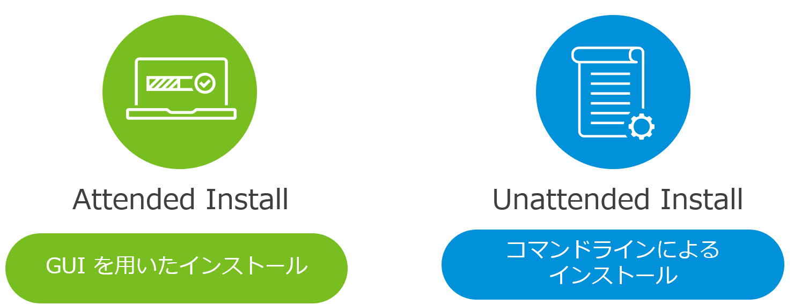
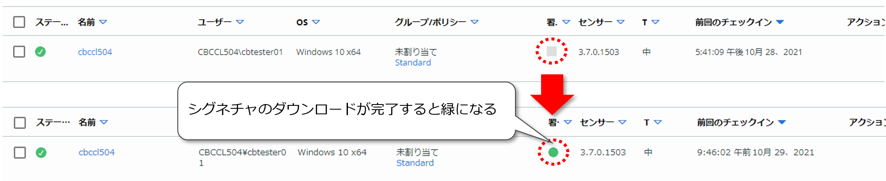

## 3.2. インストール

本節では、Windows OSへのCBセンサーのインストールについて記載します。

CBセンサーのWindows OSへの対応状況は以下のリンクから確認できます。

参考資料：
- Carbon Black Cloud sensor: Windows desktop support  
  https://community.carbonblack.com/t5/Documentation-Downloads/Carbon-Black-Cloud-sensor-Windows-desktop-support/ta-p/66273
- Carbon Black Cloud sensor: Windows Server support  
  https://community.carbonblack.com/t5/Documentation-Downloads/Carbon-Black-Cloud-sensor-Windows-Server-support/ta-p/66270

インストールに際しては、CBセンサーがインターネット経由でCBCバックエンドに接続できる必要があります。CBセンサーをインストールするエンドポイントがファイアウォールやProxy等で保護されている場合には、以下の通信要件を満たす構成が必要となります。
- 用途によっては、CBCテナントが存在するAWSリージョン毎に接続先が異なるものがあります。
- 2021年10月時点の情報です。

全リージョン共通

| 用途 | 接続先URL | 接続先ポート |
| -- |-- |-- |
| コンテンツ管理(UBSおよびDynamic Rules Engineの更新) | https://content.carbonblack.io | TCP/443,54443 |
| ローカルスキャンのシグネチャ更新 | http://updates2.cdc.carbonblack.io/update2 | TCP/80 |
|                               | https://updates2.cdc.carbonblack.io/update2 | TCP/443 |
| センサーインストール証明書の失効確認 | http://ocsp.godaddy.com | TCP/80 |
|                                   | http://crl.godaddy.com | TCP/80 |

リージョンごとに異なる接続先 URL
* 接続先ポート： TCP/443,54443

| CBCテナント(AWSリージョン) | 用途    	| 接続先 URL |
| ----------------------- | --------- | ----------- |
| Prod01(US-East-1)       | CBCコンソール／API | https://dashboard.confer.net |
|                         | センサー接続先     | https://devices.confer.net | 
| Prod02(US-East-1)       | CBCコンソール／API | https://defense.conferdeploy.net |
|                         | センサー接続先     | https://dev5.conferdeploy.net |
| Prod05(US-East-1)       | CBCコンソール／API | https://defense-prod05.conferdeploy.net |
|                         | センサー接続先     | https://dev-prod05.conferdeploy.net |
| Prod06(EU-Central-1)    | CBCコンソール／API | https://defense-eu.conferdeploy.net |
|                         | センサー接続先     | https://dev-prod06.conferdeploy.net |
| ProdNRT(AP-Northwest-1) | CBCコンソール／API | https://defense-prodnrt.conferdeploy.net |
|                         | センサー接続先     | https://dev-prodnrt.conferdeploy.net |
| ProdSYD(AP-Southwest-2) | CBCコンソール／API | https://defense-prodsyd.conferdeploy.net |
|                         | センサー接続先     | https://dev-prodsyd.conferdeploy.net |

この他にも、Carbon Black Cloud Endpoint Enterpriseの機能であるUnified Binary Store(UBS)からのバイナリおよびメタデータのダウンロードURLが存在しますが、本書では取り扱いません。UBSダウンロード用URLの情報については、以下の参考資料を参照して下さい。

参考資料：
- ファイアウォールの構成  
  https://docs.vmware.com/jp/VMware-Carbon-Black-Cloud/services/cbc-sensor-installation-guide/GUID-06D2CB73-968A-466E-BD69-B7480CBA800A.html

CBセンサーは、インストール時にProxy設定の自動検出を試みますが、これに失敗した場合には、後述する「3.2.2.Unattended install（コマンドラインインストール）」において明示的なProxy設定を行うことが可能です。

参考資料：
- Carbon Black Cloud: What Ports must be opened on the Firewall and Proxy Servers?  
  https://community.carbonblack.com/t5/Knowledge-Base/Carbon-Black-Cloud-What-Ports-must-be-opened-on-the-Firewall-and/ta-p/36295
- プロキシの構成  
  https://docs.vmware.com/jp/VMware-Carbon-Black-Cloud/services/cbc-sensor-installation-guide/GUID-61DE771E-ADE8-42C4-8A20-CDAA85429C8A.html

また、インターネット接続ができない等の理由から、センサーインストール証明書の失効確認ができない環境においても、Unattended installのパラメータで失効確認を無効化することが可能です。

参考資料：
- Carbon Black Cloud: How To Configure Sensor Not To Require CRL Checks  
  https://community.carbonblack.com/t5/Knowledge-Base/Carbon-Black-Cloud-How-To-Configure-Sensor-Not-To-Require-CRL/ta-p/73036

Windows OSへのCBセンサーのインストール方法には、GUIインストーラを使用するAttended installとコマンドラインを使用するUnattended installの2通りの方法があります。

Attended installはエンドポイントから手動でGUIのインストールウィザードを進めていくインストール方式です。

コマンドラインベースのUnattended installをActive Directoryのグループポリシーや組織で利用しているエンドポイント管理ツール等と組み合わせることで、CBセンサーの大規模展開を自動化することが可能になります。

> 本書では大量のセンサー展開や、インストールの自動化については取り扱いません。

Attended install実行時には、事前定義済みのStandardポリシーが自動的に割り当てられますので、インストール完了後にポリシーを指定し直す必要があります。

Unattended installの場合は、インストール時に適用するポリシーを指定することが可能です。

組織に初めてCBセンサーを導入する際のベストプラクティスとして、最初はMonitoredポリシーを基にポリシーを作成して、ブロックや隔離等のアクションをバイパスにした状態でイベント監視のみを行い、CBセンサーが組織で利用しているアプリケーションに与える影響を把握した上で、徐々にブロックおよび隔離ルールを追加していく方法が推奨されています。

### 3.2.1. Attended install（GUIインストール）

本項では、Attended installの手順について記載します。

Attended installでは、インストール中にActivation Codeの入力が求められます。

Activation Codeは、CBC管理者からAttended installを実行するユーザー宛に送信されるインストールリクエストメールに記載されています。

WIP:[手順：CBセンサーのAttended install（GUIインストール）]
<!-- (walkthroughs/03-02_attended-install.md) -->

Standardポリシーが既定の場合、バックグランドスキャン(標準)とローカルスキャンが有効に設定されています。「3.1.2.4.センサー設定」にて前述した通り、バックグラウンドスキャンはインストール完了後のこのタイミングで1回のみ実行されます。エンドポイントのファイル数にもよりますが、標準モードで3～5日程度かかる場合もあります。

また、ローカルスキャンのシグネチャの初回ダウンロードについては、ネットワーク環境にも依存しますが、数時間かかる場合があります。シグネチャのダウンロードが完了すると、CBCコンソールに表示されるセンサーの署名アイコンが灰色から緑に変化します。

参考資料：
- 方法 1: センサーをエンドポイントにインストールするユーザーを招待する  
  https://docs.vmware.com/jp/VMware-Carbon-Black-Cloud/services/cbc-sensor-installation-guide/GUID-B602AE54-1886-4A7D-B456-4A55912497C7.html

センサーのインストールが完了した後、適用されているポリシーを、事前定義済みStandardポリシーから「3.1.3.ポリシーの作成」で作成したポリシーに変更します。

WIP:[手順：ポリシーの割り当て]
<!-- (walkthroughs/03-02_policy-assign.md) -->

### 3.2.2. Unattended install（コマンドラインインストール）

本項では、Unattended installの手順について記載します。

実行するコマンドラインは以下のようになります。

> msiexec /q /i installer_vista_win7_win8-64-3.7.0.1503.msi /L\*vx uainst.log COMPANY_CODE=xxxxxxxxxxxxxxxxxxxx GROUP_NAME=Policy#1 CLI_USERS=S-1-5-11

各パラメータの間は半角スペースが必要です。COMPANY_CODEなどは実際の値に置き換える必要があります。

今回は、以下のパラメータを使用してUnattended installを実施します。

<table>
  <thead>
    <tr class="header">
      <th>パラメータ</th>
      <th>説明</th>
    </tr>
  </thead>
  <tbody>
    <tr class="odd">
      <td>/q</td>
      <td>
コマンドラインインストールには必須。

      
このオプション無しで実行すると、GUIのインストールウィザードが起動して、アクティベーションコードが要求される。
</td>
    </tr>
    <tr class="even">
      <td>
/i [インストーラファイル名(パス指定も可能)]

      
例）/i installer_vista_win7_win8-64-3.7.0.1503.msi
</td>
      <td>
コマンドラインインストールには必須。

      
ダウンロードしたセンサーキット(インストーラ)のファイルパスを指定する。
</td>
    </tr>
    <tr class="odd">
      <td>
/L *vx [ログファイル名(パス指定も可能)]

      
例) /L *vx uainst.log
</td>
      <td>
ログの生成オプション

      
/L*：インストールログを生成する。

      
/L*vx：詳細なインストールログを生成する。
</td>
    </tr>
    <tr class="even">
      <td>
COMPANY_CODE=[会社登録コード]

      
例) COMPANY_CODE=xxxxxxxxxxxxxxxxxxxx
</td>
      <td>
コマンドラインインストールには必須。

      
CBCコンソールで確認可能な会社登録コードを指定する。
</td>
    </tr>
    <tr class="odd">
      <td>
GROUP_NAME=[ポリシー名]

      
例) GROUP_NAME=Policy#1
</td>
      <td>センサーインストール時に適用するポリシーを指定したい場合には、ポリシー名を指定する。</td>
    </tr>
    <tr class="even">
      <td>
CLI_USER=[ユーザー／グループのSID]

      
例) CLI_USERS = S-1-5-11（Authenticated UsersのSID「S-1-5-11」を指定。）
</td>
      <td>
認証されたRepCLIコマンドを利用できるユーザーやグループのSIDを指定する。

      
後述する「&lt;参考 6：RepCLIコマンドについて&gt;」を参照。
</td>
    </tr>
  </tbody>
</table>

今回は使用しませんが、上記以外に使用頻度が高いと思われるパラメータについても紹介します。

<table>
  <thead>
    <tr class="header">
      <th>パラメータ</th>
      <th>説明</th>
    </tr>
  </thead>
  <tbody>
    <tr class="odd">
      <td>
CURL_CRL_CHECK=[0 or 1]

      
例) CURL_CRL_CHECK=0
</td>
      <td>
センサーのインストール証明書の失効確認の有効／無効を切り替える。

      
・有効：CURL_CRL_CHECK=1 (既定値)

      
・無効：CURL_CRL_CHECK=0
</td>
    </tr>
    <tr class="even">
      <td>
PROXY_SERVER=[IPアドレス:ポート]

      
例) PROXY_SERVER=10.10.10.1:8000
</td>
      <td rowspan="3">センサーインストール時の自動プロキシ検出が成功しなかった場合に、明示的にプロキシサーバの情報を設定する。</td>
    </tr>
    <tr class="odd">
      <td>
PROXY_USER=[Proxy認証用ユーザー名]

      
例) PROXY_USER=user01
</td>
    </tr>
    <tr class="even">
      <td>
PROXY_PASSWD=[ Proxy認証用パスワード]

      
例) PROXY_PASSWD=P@s$w0rd
</td>
    </tr>
  </tbody>
</table>

本書では、全てのパラメータについては取り扱いません。
他のパラメータについては、以下の参考資料を参照して下さい。

参考資料：
- Windows センサーのコマンド ライン パラメータ  
  https://docs.vmware.com/jp/VMware-Carbon-Black-Cloud/services/cbc-sensor-installation-guide/GUID-2E3B5EC0-8E89-4BD3-A18E-53AB8FCA4CBA.html
- Windows センサーでサポートされるコマンド  
  https://docs.vmware.com/jp/VMware-Carbon-Black-Cloud/services/cbc-sensor-installation-guide/GUID-0FBA8BFB-8E3D-42FB-A589-8E31B184591B.html
- Carbon Black Cloud: How to Perform an Unattended Installation of the Windows Sensor  
  https://community.carbonblack.com/t5/Knowledge-Base/Carbon-Black-Cloud-How-to-Perform-an-Unattended-Installation-of/ta-p/65874
- CURL CRL チェックの無効化  
  https://docs.vmware.com/jp/VMware-Carbon-Black-Cloud/services/cbc-sensor-installation-guide/GUID-31EFBF6E-66DF-4070-B005-F5785F069746.html
- Carbon Black Cloud: How To Configure Sensor Not To Require CRL Checks  
  https://community.carbonblack.com/t5/Knowledge-Base/Carbon-Black-Cloud-How-To-Configure-Sensor-Not-To-Require-CRL/ta-p/73036
- Cb Defense: Does the sensor support proxy server authentication?  
  https://community.carbonblack.com/t5/Knowledge-Base/Cb-Defense-Does-the-sensor-support-proxy-server-authentication/ta-p/48180

> [参考 6：RepCLIコマンドについて](tips/tips_06.md)

RepCLIコマンドとは、CBセンサーと一緒にインストールされるRepCLIユーティリティで使用可能なコマンドセットです。エンドポイントにおいてRepCLIコマンドを使用することで、インストールされたCBセンサーを管理することが可能になります。

RepCLIコマンドを利用するには、C:\Program Files\Confer\RepCLI.exeを実行します。
パラメータ無でRepCLI.exeを実行すると、利用可能なコマンドの一覧と説明を確認することができます。

本書ではRepCLIコマンドの詳細については取り扱わないため、以下の参考資料を参照して下さい。

参考資料：
- Carbon Black Cloud: What is the RepCLI Utility?  
  https://community.carbonblack.com/t5/Knowledge-Base/Carbon-Black-Cloud-What-is-the-RepCLI-Utility/ta-p/61991
- Carbon Black Cloud: How to Access RepCLI Utility  
  https://community.carbonblack.com/t5/Knowledge-Base/Carbon-Black-Cloud-How-to-Access-RepCLI-Utility/ta-p/62517
- Carbon Black Cloud: How to Enable Authentication for RepCLI Utility During Sensor Install  
  https://community.carbonblack.com/t5/Knowledge-Base/Carbon-Black-Cloud-How-to-Enable-Authentication-for-RepCLI/ta-p/62513

Unattended installの手順は、以下の通りです。

WIP:[手順：CBセンサーのUnattended install（コマンド ライン インストール）]
<!-- (walkthroughs/03-02_unattended_install.md) -->

参考資料：
- 方法 2: コマンド ラインまたはソフトウエア配布ツールを使用してエンドポイントにセンサーをインストールする  
  https://docs.vmware.com/jp/VMware-Carbon-Black-Cloud/services/cbc-sensor-installation-guide/GUID-5D7F222D-83FA-4D42-88C7-074F8EF8257D.html

### 3.2.3. インストール後の確認項目

本項では、CBセンサーインストール後の確認項目について、記載します。

#### 3.2.3.1. サービス

CBセンサーインストール後、エンドポイントに2つのサービスが追加されます。

| サービス名    | 表示名                  | ブートの種類 | 状態 | 備考 |
| ------------ | ---------------------- | ---- | ----- | --- |
| CbDefense    | CB Defense             | 自動 | 実行中 |  |
| CbDefenseWSC | Carbon Black Cloud WSC | 自動 | 実行中 | ポリシーのセンサー設定で「Windowsセキュリティセンターの使用」が無効な場合には停止 |

#### 3.2.3.2. ドライバ

CBセンサーインストール後、エンドポイントに4つのドライバが追加されます。

| 種類                     | ドライバ名 | 表示名                                   | 起動モード |
|--------------------------|------------|------------------------------------------|------------|
| ファイルシステムドライバ | ctifile    | Carbon Black Cloud File Filter           | ブート |
| カーネルドライバ         | ctinet     | Carbon Black Cloud Sensor Network Filter | システム |
|                          | CbELAM     | Carbon Black ELAM                        | ブート |
|                          | CbDisk     | Carbon Black Cloud Disk Filter Driver    | ブート |

#### 3.2.3.3. プログラム

CBセンサーインストール後、エンドポイントに1つのプログラムが追加されます。

| 名前                             | 発行元      | バージョン |
|----------------------------------|-------------|----------------------------------------------|
| Carbon Black Cloud Sensor 64-bit | VMware, Inc | インストール時に選択したセンサーのバージョン |

#### 3.2.3.4. スタートアップ

CBセンサーインストール後、エンドポイントに1つのスタートアップが追加されます。

| 名前                                               | 発行元      | 状態 |
|----------------------------------------------------|-------------|------|
| Carbon Black Cloud Sensor Notification Utility x86 | VMware, Inc | 有効 |

#### 3.2.3.5. 確認手順

センサーインストール完了後の確認手順は、以下の通りです。

WIP:[手順：CBセンサーインストール完了の確認]
<!-- (walkthroughs/03-02_sensor-install-check.md) -->

> [参考 7：CBセンサーによるイベントデータのアップロード間隔について](tips/tips_07.md)

### 3.2.4. アンインストール

本項では、CBセンサーのアンインストール手順について記載します。

センサーのアンインストールには、CBCコンソール経由でアンインストールする方法と、エンドポイントの操作でアンインストールする方法の2つの方法があります。

#### 3.2.4.1. CBCコンソール操作によるアンインストール

エンドポイントを操作することなく、CBCコンソール経由でCBセンサーをアンインストールすることが可能です。

CBCコンソール操作によるCBセンサーのアンインストール手順は、以下の通りです。

WIP:[手順：CBCコンソール操作によるCBセンサーのアンインストール]
<!-- (walkthroughs/03-02_sensor-uninstall-endpoint.md) -->

※インターネット接続とエンドポイントのWindowsローカル管理者権限が必要です。

参考資料：
- Carbon Black Cloud コンソールを使用したエンドポイントからのセンサーのアンインストール  
  https://docs.vmware.com/jp/VMware-Carbon-Black-Cloud/services/cbc-sensor-installation-guide/GUID-A94C1D6A-678A-4489-B5EC-67F60522D45C.html
- Cb Defense: Deregistered Sensor FAQ  
  https://community.carbonblack.com/t5/Knowledge-Base/Cb-Defense-Deregistered-Sensor-FAQ/ta-p/34151

#### 3.2.4.2. エンドポイント操作によるアンインストール

CBCコンソールを使用せずに、エンドポイントからの操作によって、センサーをアンインストールすることも可能です。

この場合、悪意のあるユーザーによって、センサーが不正にアンインストールされてしまう可能性もあります。これを防止するために、センサーのアンインストール時に、アンインストールコードを要求するように、ポリシーを設定することが可能になっています(「3.1.2.4.センサー設定」を参照)。

エンドポイントでCBセンサーをアンインストールする手順は、以下の通りです。

※インターネット接続とエンドポイントのWindowsローカル管理者権限が必要です。

WIP:[手順：エンドポイント操作によるCBセンサーのアンインストール]
<!-- (walkthroughs/03-02_sensor-uninstall-endpoint.md) -->

参考資料：
- エンドポイントでセンサーをアンインストールするコードの要求  
  https://docs.vmware.com/jp/VMware-Carbon-Black-Cloud/services/cbc-sensor-installation-guide/GUID-6D511596-6A71-486D-ABAC-59B8345AF14D.html
- エンドポイントからの Windows センサーのアンインストール  
  https://docs.vmware.com/jp/VMware-Carbon-Black-Cloud/services/cbc-sensor-installation-guide/GUID-A827668B-B4F0-4C1C-8C4B-A47474411AF6.html
