## 3.3. レピュテーション

CBCバックエンドによるクラウドスキャンや、シグネチャを用いたローカルスキャンによる脅威判定の指標となるのが、レピュテーションと呼ばれる、アプリケーションの信頼度です。

レピュテーションの取得には、次の方法があります。
1. クラウド側での定義：アプリケーション実行時に、インターネット経由でCBCから取得
2. シグネチャでの定義：ローカルスキャンが有効であれば、アプリケーション実行時にシグネチャから取得
3. ユーザー定義：CBCコンソールでユーザーが承認リストや禁止リストに追加（ハッシュ値で、ITツール、証明書などを指定）

既知のマルウェアやアプリケーションに関するレピュテーションについては、あらかじめCBで定義されているものもあります。そして、ユーザーがアプリケーションを承認リストや禁止リストに追加することで、明示的にレピュテーションを指定することも可能になっています。

また、CBCバックエンドによるクラウドスキャンと、シグネチャを用いたローカルスキャンでは、それぞれ独自のレピュテーションを使用して脅威を判定します。そのため、エンドポイントがインターネットに接続できない環境でも、ローカルスキャンが有効な状態であればシグネチャを用いたレピュテーションによる脅威判定が可能になります。

ローカルスキャンの有無によって、レピュテーションが付与されるプロセスが異なります。詳細については、「\<参考 2：ローカルスキャンとレピュテーション割り当ての関係\>」を参照して下さい。

また、エンドポイントのネットワークドライブに配置されているファイルへのレピュテーションの付与については、「\<参考 4：ネットワークドライブとレビュテーション割り当ての関係\>」を参照して下さい。


### 3.3.1. レピュテーションの値と優先度

レピュテーションは、11段階の値によって表現され、エンドポイントで実行されたアプリケーションには、必ず何らかのレピュテーションが付与されます。

既にレピュテーションが付与されているアプリケーションを、承認リストや禁止リストに追加した場合、1つのアプリケーションに対して、複数のレピュテーションが存在することになります。この様な場合には、レピュテーションの優先度によって、優先されるレピュテーションが決定されます。

レピュテーションの値と優先度は、以下の通りです(優先度1が最優先)。

<table>
<colgroup>
<col style="width: 7%" />
<col style="width: 34%" />
<col style="width: 57%" />
</colgroup>
<thead>
<tr class="header">
<th>優先度</th>
<th>レピュテーション(値)</th>
<th>説明</th>
</tr>
</thead>
<tbody>
<tr class="odd">
<td>1</td>
<td>Ignore</td>
<td>最高の優先度。CB製品のファイル群。</td>
</tr>
<tr class="even">
<td>2</td>
<td><p>Company Allowed</p>
<p>(COMPANY_WHITE_LIST)</p></td>
<td>ユーザーが手動で、承認リストにハッシュ値を登録したもの。</td>
</tr>
<tr class="odd">
<td>3</td>
<td><p>Company Banned</p>
<p>(COMPANY_BLACK_LIST)</p></td>
<td>ユーザーが手動で、禁止リストにハッシュ値を登録したもの。</td>
</tr>
<tr class="even">
<td>4</td>
<td><p>Trusted White</p>
<p>(TRUSTED_WHITE_LIST)</p></td>
<td>クラウドもしくはローカルスキャナー、あるいはその両方から、CBが信頼できると判定したもの。</td>
</tr>
<tr class="odd">
<td>5</td>
<td><p>Known Malware</p>
<p>(KNOWN_MALWARE)</p></td>
<td>クラウドもしくはローカルスキャナー、あるいはその両方から、CBが既知のマルウェアと判定したもの。</td>
</tr>
<tr class="even">
<td>6</td>
<td><p>Suspect/Heuristic Malware</p>
<p>(SUSPECT_MALWARE)</p></td>
<td>疑わしいソフトウェアであるが、必ずしも悪意があるとは限らないと、CBが判定したもの。</td>
</tr>
<tr class="odd">
<td>7</td>
<td><p>Adware/PUP Malware</p>
<p>(PUP)</p></td>
<td>アドウェアおよび潜在的に望ましくないソフトウェアであると、CBが判定したもの。</td>
</tr>
<tr class="even">
<td>8</td>
<td><p>Local White</p>
<p>(LOCAL_WHITE)</p></td>
<td><p>・CBセンサーをインストールする前からエンドポイントに存在していたもの。</p>
<p>・ユーザーが手動で登録したITツールによって登録されたもの。</p>
<p>・ユーザーが手動で登録した証明書によって、ファイル署名の有効性が検証できたもの。</p></td>
</tr>
<tr class="odd">
<td>9</td>
<td><p>Common White</p>
<p>(COMMON_WHITE_LIST)</p></td>
<td><p>・既知の良好または不良リストにハッシュ値が存在しないが、ファイルが署名されているもの。</p>
<p>・既知の良好または不良リストにハッシュ値が存在しないが、以前に分析されたことがあるハッシュ値。</p></td>
</tr>
<tr class="even">
<td>10</td>
<td><p>Not Listed/Adaptive White</p>
<p>(NOT_LISTED/ADAPTIVE_WHITE_LIST)</p></td>
<td><p>NOT_LISTED: CBにハッシュ値が登録されていないもの。</p>
<p>ADAPTIVE_WHITE_LIST: 完全に信頼するには追加情報が必要なもの。</p></td>
</tr>
<tr class="odd">
<td>11</td>
<td><p>Unknown</p>
<p>(UNKNOWN)</p></td>
<td><p>最低の優先度。センサーがまだレピュテーションリクエストを送信していないもの、通常、センサーがバックエンドへアクセスできていないことを意味します。</p>
<p>※インターネット接続なしで、ローカルスキャンも無効な場合等。</p></td>
</tr>
</tbody>
</table>

判定の確実性が低いものほど、レピュテーションの優先度が低い傾向にあります。逆にCB製品のファイル群や、ユーザー自身が明示的に承認リストや禁止リストに追加したものなど、確実に白黒判定ができるものについては、優先度が高く設定されています。

参考資料：
- レピュテーションのリファレンス  
  https://docs.vmware.com/jp/VMware-Carbon-Black-Cloud/services/carbon-black-cloud-user-guide/GUID-DD155BF4-1C8F-4104-83E6-305AC559674C.html
- Endpoint Standard: Reputation Priority  
  https://community.carbonblack.com/t5/Knowledge-Base/Endpoint-Standard-Reputation-Priority/ta-p/51797

> [参考 8：レピュテーションとポリシールール、Dynamic Rules Engine](tips/tips_08.md)


### 3.3.2. 禁止リストと承認リスト

既定のレピュテーションに加えて、特定のアプリケーションを禁止リストや承認リストに追加することで、アプリケーションの実行を明示的に禁止したり、承認したりすることも可能です。


#### 3.3.2.1. 禁止リストへの登録

禁止リストへのアプリケーションの登録方法には、アプリケーションのハッシュ値を手動登録する方法と、自動禁止リストを構成する方法の2つがあります。

##### ■禁止リストへのハッシュ値の登録

実行を禁止したいアプリケーションのSHA-256ハッシュ値を登録します。

この方法で登録されたアプリケーションのレピュテーションの値は、「COMPANY_BLACK_LIST」になります。

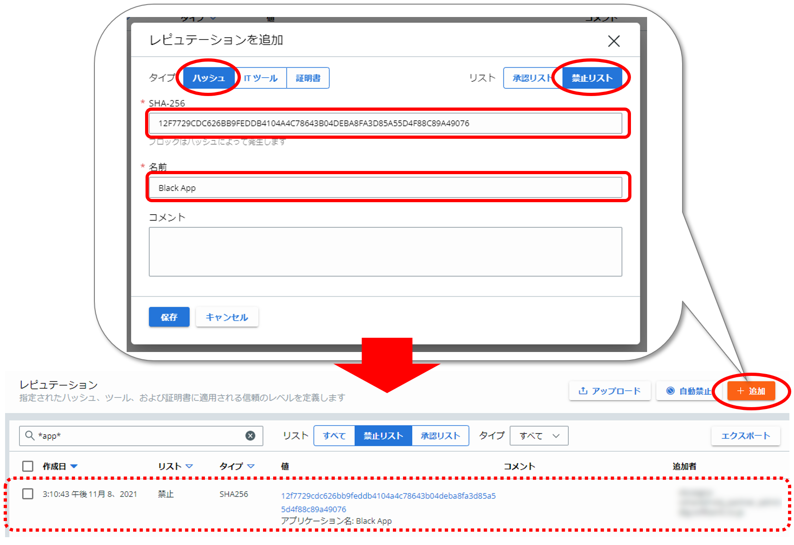

参考資料：
- ハッシュを禁止リストへの追加  
  https://docs.vmware.com/jp/VMware-Carbon-Black-Cloud/services/carbon-black-cloud-user-guide/GUID-668CAF64-AD91-4392-A01A-65EBC0EB1AD7.html

##### ■自動禁止リストの構成

ここで指定した閾値と同一か、それ以上の脅威の重要度を有するアプリケーションを自動的に禁止リストに追加することが可能です。

> なお、脅威の重要度については「5.応答（Response）」に記載します。

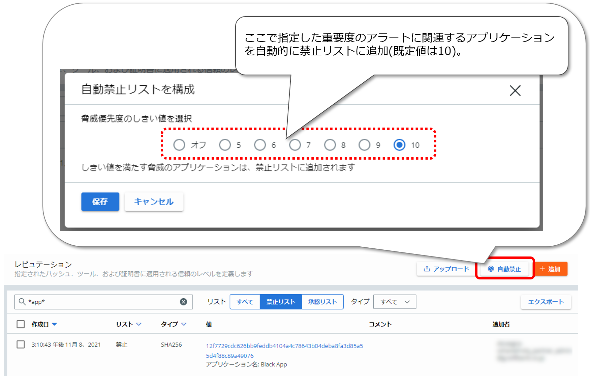

参考資料：
- 自動禁止リストを構成  
  https://docs.vmware.com/jp/VMware-Carbon-Black-Cloud/services/carbon-black-cloud-user-guide/GUID-95EAC4FE-8DBE-421E-82E2-44393491FCA6.html
- Carbon Black Cloud: Enabling Auto-Ban in the Console Modifies the Blocking Rule Policy for Application on Company Banned List  
  https://community.carbonblack.com/t5/Knowledge-Base/Carbon-Black-Cloud-Enabling-Auto-Ban-in-the-Console-Modifies-the/ta-p/101357


#### 3.3.2.2. 承認リストへの登録

承認リストへのアプリケーションの登録方法には、アプリケーションのハッシュ値を手動登録する方法に加えて、特定のITツールを承認リストへ登録することで、そのツールで生成されたアプリケーションや、登録したITツールの子プロセスが生成したアプリケーションを信頼する方法、アプリケーションに付与したデジタル署名の署名者を登録することで、署名されたアプリケーションを信頼する方法の3つが存在します。

##### ■承認リストへのハッシュ値の登録

承認したいアプリケーションのSHA-256ハッシュ値を登録します。

この方法で登録されたアプリケーションのレピュテーションの値は、「COMPANY_WHITE_LIST」になります。

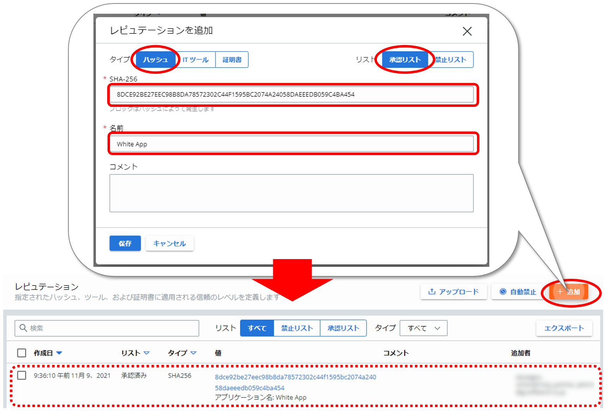

参考資料：
- ハッシュを承認リストに追加  
  https://docs.vmware.com/jp/VMware-Carbon-Black-Cloud/services/carbon-black-cloud-user-guide/GUID-8D2BE154-E7DB-4D48-AED8-6C21F89C459B.html

##### ■承認リストへのITツールの登録

承認したいITツールのパスを登録します。指定したITツールの子プロセスによって作成されたファイルも信頼する場合には、\[すべての子プロセスを含む\]にチェックを入れます。

この方法で登録されたアプリケーションのレピュテーションは「LOCAL_WHITE」になります。

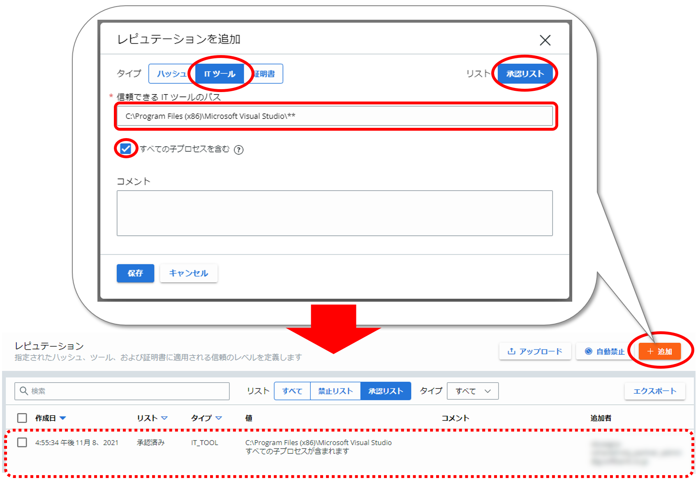

ITツールのパスの指定には、ワイルドカードを使用することも可能です。ワイルドカードについては、「3.1.2.2.防止設定」の\[許可\]ルールと\[ブロックおよび隔離\]ルールを参照して下さい。

参考資料：
- 信頼される IT ツールの承認リストへの追加  
  https://docs.vmware.com/jp/VMware-Carbon-Black-Cloud/services/carbon-black-cloud-user-guide/GUID-F40BE4E7-6793-4605-96FD-132915E5CDD5.html
- Carbon Black Cloud: How to Utilize IT Tools Allow list Feature  
  https://community.carbonblack.com/t5/Knowledge-Base/Carbon-Black-Cloud-How-to-Utilize-IT-Tools-Allow-list-Feature/ta-p/37958
- Endpoint Standard: Why isn't the reputation updated to LOCAL WHITE?  
  https://community.carbonblack.com/t5/Knowledge-Base/Endpoint-Standard-Why-isn-t-the-reputation-updated-to-LOCAL/ta-p/95472

##### ■承認リストへの証明書の登録

承認したいアプリケーションファイルのデジタル署名の\[署名者名\]を\[署名者\]に登録します。

この方法で登録されたアプリケーションのレピュテーションはLOCAL_WHITEになります。

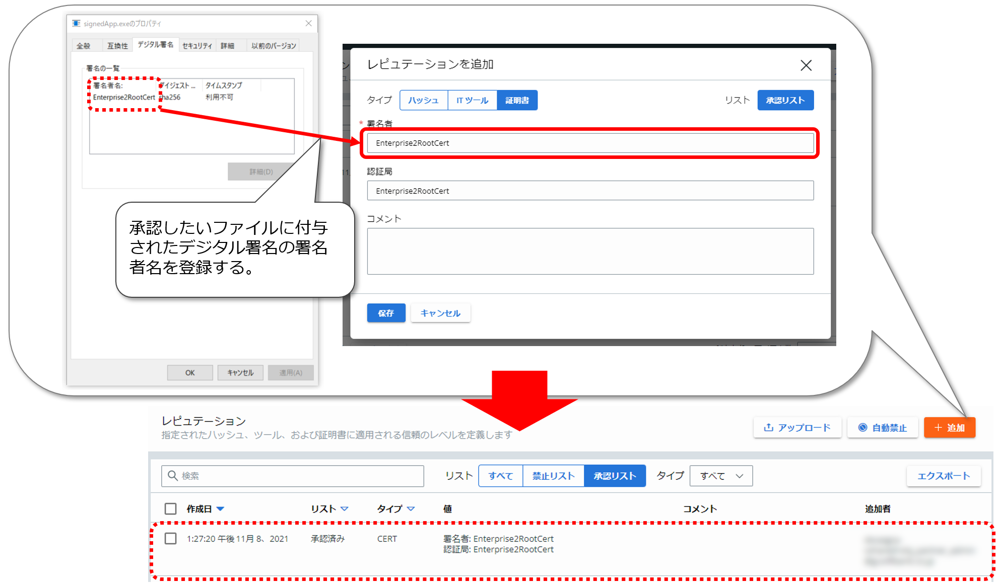

また、\[調査\] – \[イベント\]のプロセス情報から、\[追加\]をクリックして登録することも可能です。

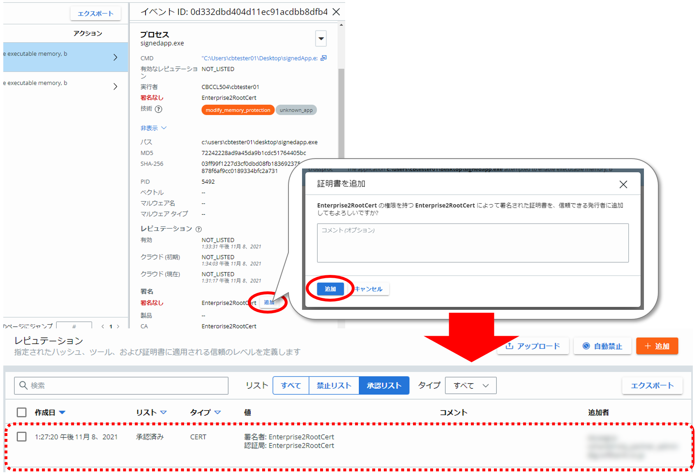

参考資料：
- 証明書を承認リストに追加  
  https://docs.vmware.com/jp/VMware-Carbon-Black-Cloud/services/carbon-black-cloud-user-guide/GUID-460E5C91-3DDA-4E53-BD39-2BF7873D4E6A.html
- Endpoint Standard: How to add a Certificate to the Approved List  
  https://community.carbonblack.com/t5/Knowledge-Base/Endpoint-Standard-How-to-add-a-Certificate-to-the-Approved-List/ta-p/64823
- Endpoint Standard: Cert Approved Files are Blocked or Terminated Based On Not_Listed Reputation  
  https://community.carbonblack.com/t5/Knowledge-Base/Endpoint-Standard-Cert-Approved-Files-are-Blocked-or-Terminated/ta-p/72359
- Endpoint Standard: Why isn't the reputation updated to LOCAL WHITE?  
  https://community.carbonblack.com/t5/Knowledge-Base/Endpoint-Standard-Why-isn-t-the-reputation-updated-to-LOCAL/ta-p/95472


#### 3.3.2.3. 登録手順

ここでは一例として、承認リストにハッシュタイプのレピュテーションを登録する手順を記載します。

まずは、レピュテーションを付与するアプリケーションファイルのハッシュ値を算出しておく必要があります。どの様な方法で算出しても構いませんが、使用するハッシュアルゴリズムはSHA256である必要があります。

ここでは、Windows PowerShellのGet-FileHashコマンドレットを使用して、ハッシュ値を算出します。PowerShellを起動して、以下のコマンドを実行します。

```
PS> Get-FileHash -Algorithm SHA256 -Path [対象ファイルのパス]
```

出力されたハッシュ値を確認します。

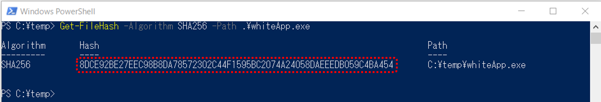


承認リストへのハッシュ値の追加手順は以下の通りです。

WIP:[手順：承認リストへのハッシュ値の登録]
<!-- (walkthroughs/03-03_hash-registration-csv.md) -->


#### 3.3.2.4. 一括登録手順

登録内容を記載したCSV形式のASCIIプレーンテキストファイルをインポートすることで、承認リストと禁止リストを一括登録することも可能です。

インポートするCSVファイルのフォーマットは、以下の5つのフィールドで構成されています。
- List Type (リストタイプ)
- Indicator Type (インジケータのタイプ)
- Indicator Value (インジケータの値)
- Description (説明)
- Extra Settings (追加設定)

CBCコンソールの\[レピュテーション\] から、右上の\[アップロード\]をクリックすると、各フィールドに関する詳しい説明を確認することができます。

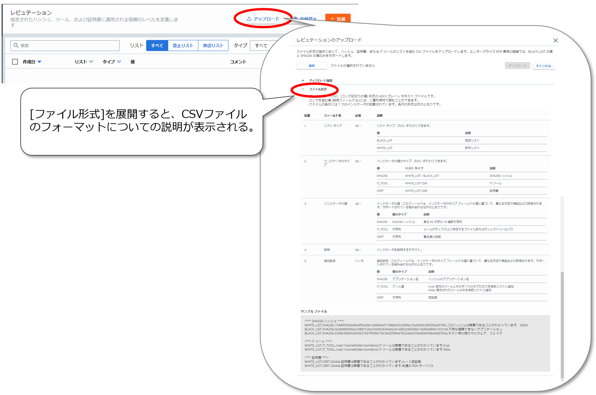

なお、サンプル ファイルには、「/\*\*\* コメント \*\*\*/」が記載されていますが、実際にインポートするファイルにコメントを含めてしまうと、インポート時にエラーが発生します。

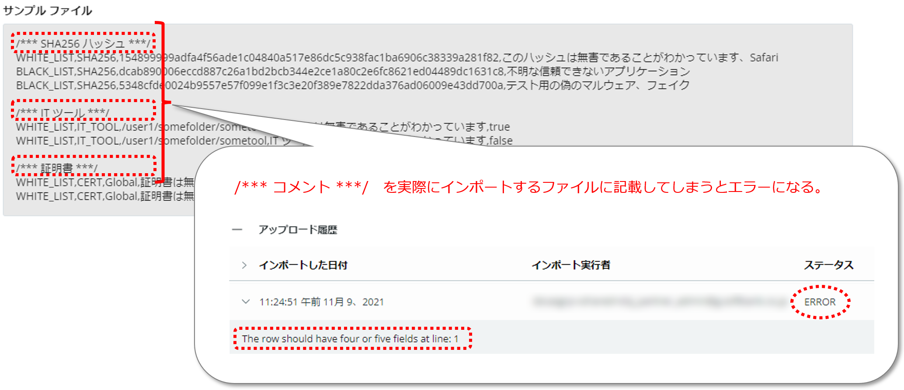

実際にインポートするCSVファイルは、以下の例を参考にして作成して下さい。

##### ■ハッシュ

例）禁止リストと承認リストにハッシュを追加する。

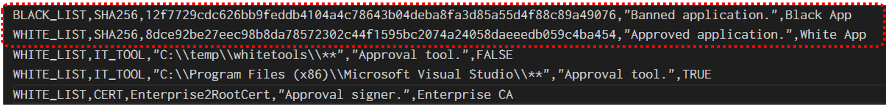

| 項目                                  | 説明                                                                                                                                                                                          |
|---------------------------------------|-----------------------------------------------------------------------------------------------------------------------------------------------------------------------------------------------|
| List Type (リストタイプ)              | 「BLACK_LIST」(禁止リスト)か「WHITE_LIST」(承認リスト)を指定する。                                                                                                                            |
| Indicator Type (インジケータのタイプ) | 「SHA256」を指定する。                                                                                                                                                                        |
| Indicator Value (インジケータの値)    | アプリケーションのSHA265ハッシュ値を指定する。                                                                                                                                                |
| Description (説明)                    | コメント欄に表示する文字列を指定する。カンマ「,」や「\\」マークを含む場合には、二重引用符「“”」で囲み、「\\」マークを表示する場合には、前に「\\」マークを重ねて「\\\\」と表記する必要がある。 |
| Extra Settings (追加設定)             | アプリケーション名に表示する名前を指定する。                                                                                                                                                  |

##### ■ITツール

例）承認リストにITツールを追加する。

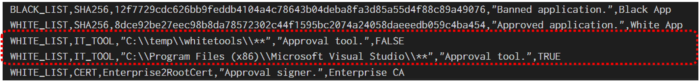

| 項目                                  | 説明                                                                                                                                                                                          |
|---------------------------------------|-----------------------------------------------------------------------------------------------------------------------------------------------------------------------------------------------|
| List Type (リストタイプ)              | 「WHITE_LIST」(承認リスト)を指定する。                                                                                                                                                        |
| Indicator Type (インジケータのタイプ) | 「IT_TOOL」を指定する。                                                                                                                                                                       |
| Indicator Value (インジケータの値)    | ITツールのPathを指定する。二重引用符「“”」で囲み、「\\」マークを表示する場合には、前に「\\」マークを重ねて「\\\\」と表記する必要がある。                                                      |
| Description (説明)                    | コメント欄に表示する文字列を指定する。カンマ「,」や「\\」マークを含む場合には、二重引用符「“”」で囲み、「\\」マークを表示する場合には、前に「\\」マークを重ねて「\\\\」と表記する必要がある。 |
| Extra Settings (追加設定)             | \[すべての子プロセスを含む\]を有効にする場合には、「TRUE」を指定し、無効にする場合には、「FALSE」を指定する。                                                                                 |

##### ■証明書

例）承認リストに証明書を追加する。

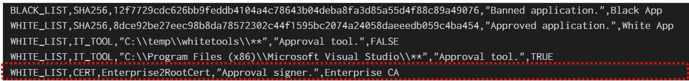

| 項目                                  | 説明                                                                                                                                                                                          |
|---------------------------------------|-----------------------------------------------------------------------------------------------------------------------------------------------------------------------------------------------|
| List Type (リストタイプ)              | 「WHITE_LIST」(承認リスト)を指定する。                                                                                                                                                        |
| Indicator Type (インジケータのタイプ) | 「CERT」を指定する。                                                                                                                                                                          |
| Indicator Value (インジケータの値)    | ファイルに付与したデジタル署名の署名者名を指定する。                                                                                                                                          |
| Description (説明)                    | コメント欄に表示する文字列を指定する。カンマ「,」や「\\」マークを含む場合には、二重引用符「“”」で囲み、「\\」マークを表示する場合には、前に「\\」マークを重ねて「\\\\」と表記する必要がある。 |
| Extra Settings (追加設定)             | 認証局に表示する文字列を指定する。                                                                                                                                                            |

参考資料：
- レピュテーションのアップロード  
  https://docs.vmware.com/jp/VMware-Carbon-Black-Cloud/services/carbon-black-cloud-user-guide/GUID-78BCD7FD-83BF-4CB2-B39A-7AA9D845CDEE.html

WIP:[手順：CSVファイルによるハッシュ一括登録]
<!-- (walkthroughs/03-03_hash-registration-csv.md) -->
