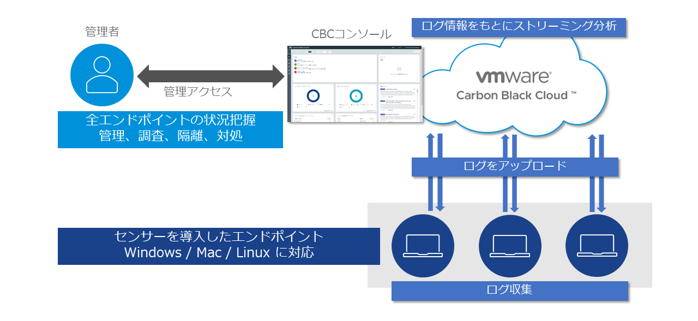
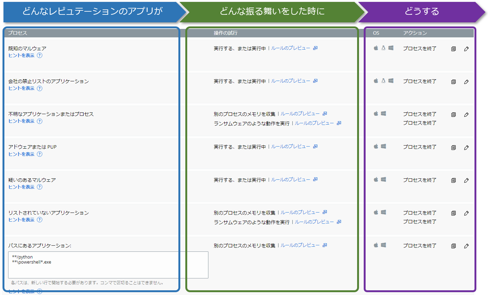

# 3. 導入と防御

本章では、CBセンサーのインストールと、それに伴うポリシー設定、レピュテーション設定について説明します。

CBCでエンドポイントを保護する際には、保護対象とするエンドポイントにCBセンサーと呼ばれるエージェントをインストールする必要があります。インストールされたCBセンサーはエンドポイントの動作ログ(イベント)を収集し、インターネット経由でCBCのクラウドバックエンドと通信して、エンドポイントを保護します。

管理者は、CBCコンソールにサインインすることで、エンドポイントにインストールされたセンサーを一元管理することが可能です。

CBセンサーはWindowsの他に、macOSとLinuxもサポートしていますが、本書ではWindowsのみを対象範囲として取り扱います。

CBセンサーがインストールされたエンドポイントには、必ず何らかのポリシーが適用されます。これによって、CBCコンソールでセンサーの設定を一元管理することが可能になります。また、ポリシーでは、レピュテーションと呼ばれるアプリケーションの信頼度を基に、エンドポイントで実行されるアプリケーションの振る舞いに対して、許可や拒否等のアクションを定義することもできます。

ポリシー作成からCBセンサーインストール、レピュテーション設定までの流れは、以下の通りです。
* ポリシー作成
* CB センサー インストール
* ポリシー適用
* レピュテーション設定

次節からは、各項目の詳細な内容について記載します。

* [3.1. ポリシー](03-1_policy.md)
* [3.2. インストール](03-2_sensor-install.md)
* [3.3. レピュテーション](03-3_reputation.md)
