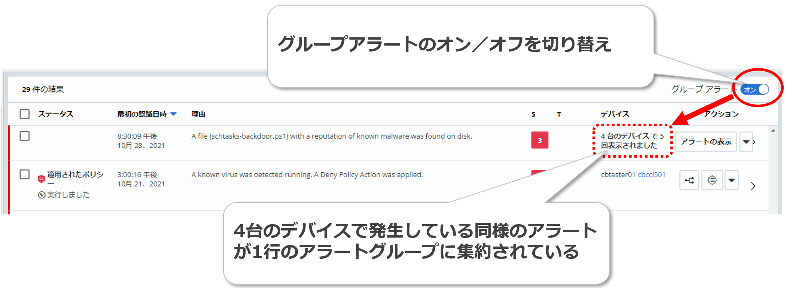
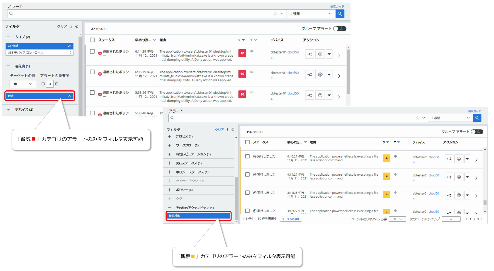
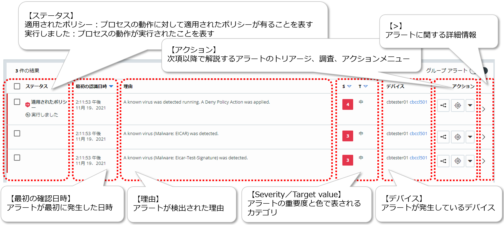
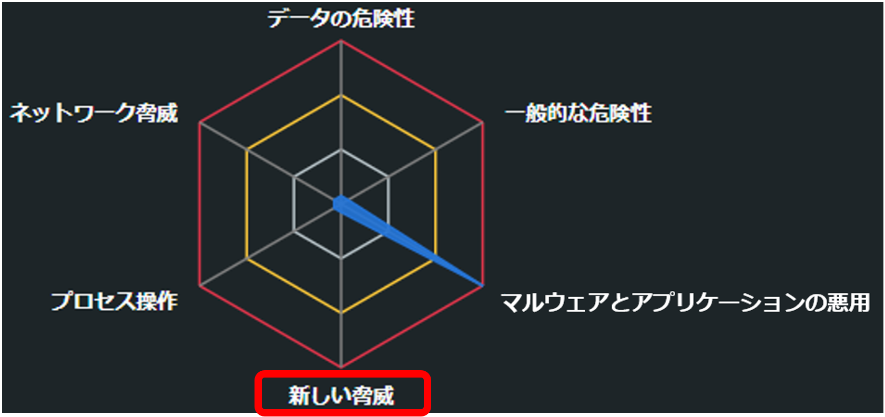

## 4.1. アラートのトリアージ

CBCで検出されたアラートのトリアージを行う前に、まずは、イベントとアラートについて知る必要があります。本節では、CBCが収集するイベントや、脅威を検出した際に出力するアラートについて確認した後、アラートのトリアージについて解説していきます。

### 4.1.1. イベント

CBセンサーによって収集されたエンドポイントの情報はイベントとして管理されます。その際、各イベントには、個別識別子としてイベントIDが割り当てられます。

イベントの詳細については、「\<参考 11：グループアラートについて\>」を参照して下さい。

複数のエンドポイントで同様のアラートが発生する場合があります。グループアラートとは、この様なアラートを単一のアラートとしてグループ化して、ThreatIdと呼ばれる新たなIDを付与して識別できるようにする機能です。複数のデバイスにまたがって、組織全体で頻繁に発生しているアラートを取り扱う際に、有用な機能となります。

グループアラートを有効にするには、アラートページ右上の\[グループ アラート\]スイッチをオンに設定します。逆に、デバイス毎のアラート表示に戻したい場合には、\[グループ アラート\]スイッチをオフに設定します。このオン／オフはいつでも切り替えられます。

複数デバイスの同類アラートがグループアラートに集約されると、グループアラート行には、\[アラートの表示\]ボタンが表示されます。

\[アラート表示\]ボタンをクリックすると、グループ化された個別アラートの一覧がフィルタ表示されます。

なお、「4.1.4.2.トリアージの実践」の最後で実施したように、グループアラートをオンにすると、複数のデバイスに限らず、同一のエンドポイントで発生した同様のアラートについても、グループ化されます。

ただし、同じデバイスで発生した同類アラートだけをグループ化したグループアラートには、\[アラートの表示\]ボタンは表示されず、threatIdも付与されません。

参考資料：
- グループアラート  
  https://docs.vmware.com/en/VMware-Carbon-Black-Cloud/services/carbon-black-cloud-user-guide/GUID-7AE51D2D-0DAD-43E5-BE01-D664B4BD8C0A.html
- アラート ID、イベント ID、および脅威 ID  
  https://docs.vmware.com/jp/VMware-Carbon-Black-Cloud/services/carbon-black-cloud-user-guide/GUID-5D9EA7FC-4C46-4B6D-8D2B-467651EF1F28.html
- Endpoint Standard: Event ID vs Alert ID vs Threat ID  
  https://community.carbonblack.com/t5/Knowledge-Base/Endpoint-Standard-Event-ID-vs-Alert-ID-vs-Threat-ID/ta-p/42859
- Cb Defense: What Does Dismissing a Group of Alerts do?  
  https://community.carbonblack.com/t5/Knowledge-Base/Cb-Defense-What-Does-Dismissing-a-Group-of-Alerts-do/ta-p/87256

「調査」に記載しますが、ここではまず、アラートについて理解する上で、エンドポイントから収集された情報がイベントという最小単位で管理されているということを理解しておいて下さい。

参考資料：
- アラート ID、イベント ID、および脅威 ID  
  https://docs.vmware.com/jp/VMware-Carbon-Black-Cloud/services/carbon-black-cloud-user-guide/GUID-5D9EA7FC-4C46-4B6D-8D2B-467651EF1F28.html
- Endpoint Standard: Event ID vs Alert ID vs Threat ID  
  https://community.carbonblack.com/t5/Knowledge-Base/Endpoint-Standard-Event-ID-vs-Alert-ID-vs-Threat-ID/ta-p/42859

### 4.1.2. アラート

CBCはイベントを解析して脅威を検出するとアラートを生成します。その際、各アラートには、個別識別子として、アラートIDが割り当てられます。

生成されたアラートは、1つもしくは、複数のイベントに紐づけられています。

ここで、エンドポイントから収集された情報がイベントという最小単位で管理されているということを思い出して下さい。

CBCでは、エンドポイントで発生した全てのアクティビティをイベントとして収集して、リアルタイムにストリーミング解析することでアラートを生成します。つまり、単発のイベントをトリガーとしたスナップショット的なマルウェア検知ではなく、一連の攻撃活動の断片となるアクティビティを集約して、1つのアラートとして出力する仕組みになっているのです。

これによって、前後関係も含めて、脅威となる攻撃活動の全容を把握することが可能になります。

イベントには、個別識別子としてイベントIDが割り当てられることは前述しましたが、アラートに紐づけられたイベントには、アラートIDが割り当てられます。同じアラートに複数のイベントが紐づけられている場合には、複数のイベントに同じアラートIDが割り当てられます。

単一のイベントのみで構成されるアラートの場合には、そのイベントに対してのみ、アラートIDが割り当てられます。また、脅威が検知されなかったイベントは、アラートに紐づかない単なるイベントとして管理されるため、アラートIDは割り当てられません。

#### 4.1.2.1. アラートのタイプ

アラートのタイプとは、アラートの検出元ソースに基づくアラートの分類です。

本書で取り扱うCarbon Black Cloud Endpoint Standardでは、「CB分析」と「USBデバイスコントロール」の２つの検出元ソースに基づくアラートのタイプが存在します。

##### ■CB分析

CB分析タイプのアラートは、CBCの分析エンジンによって生成されます。

このアラートのタイプは、「脅威」と「観察」の２つのカテゴリに分類されており、それぞれ赤と黄色の2色に分けて表示されます。

| カテゴリ        | 表示色 | 説明                                                                                   |
|-----------------|--------|----------------------------------------------------------------------------------------|
| 脅威 (Threat)   | 赤     | 悪意のあるアクティビティである可能性が高く、緊急措置が必要であると判断されたアラート。 |
| 観察 (Observed) | 黄     | 緊急措置が必要な程の脅威ではないが、観察対象としての確認や調査が必要なアラート。       |

CBCコンソールでは、各カテゴリに分類されたアラートのみをフィルタ表示することも可能です。

脅威カテゴリのアラートのみをフィルタ表示するには、CBCコンソールの\[アラート\] – \[フィルタ\] – \[優先度\]で「脅威」を選択します。また、観察カテゴリのアラートのみをフィルタ表示するには、\[アラート\] – \[フィルタ\] – \[その他のアクティビティ\]で「確認対象」を選択します。

##### ■USBデバイスコントロール

「3.1.2.2.防止設定」に記載した\[USBデバイスのブロック\]ルールによって、ポリシーの拒否アクションがトリガーされて、ユーザーによるUSBデバイスへのアクセスがブロックされた場合に発生するアラートのタイプになります。

このタイプのアラートは、トリアージしたり調査したりすることができません。

参考資料：
- Device Control: How To View and Manage Alerts  
  https://community.carbonblack.com/t5/Endpoint-Standard-Documents/Device-Control-How-To-View-and-Manage-Alerts/ta-p/97486

> [参考 9：アラートタイプ「ウォッチリスト」について](tips/tips_09.md)

#### 4.1.2.2. アラートの優先度

アラートの相対的な重要度を表す脅威レベルと、前項「4.1.2.1.アラートのタイプ」に記載した「脅威」と「観察」の2種類のカテゴリを併せて、CB分析タイプのアラートの優先度を判断することができます。

##### ■アラートの重要度(Severity)

アラートの相対的な重要度を表す脅威レベルは、1から10までのスコアによって表現されます。

各脅威レベルを表す脅威スコアに該当する脅威は以下の通りです。

| 脅威スコア (脅威レベル) | 該当する脅威 |
| ----------------------| ----------- |
| 1～2 | ポートスキャン、マルウェアのドロップ、システム構成ファイルの変更、永続性等。 |
| 3～5 | マルウェアの実行、一般的なウイルスのような動作、ユーザー入力の監視、潜在的なメモリのスクレイピング、パスワードの盗難等。 |
| 6～10 | エクスプロイト、リバースシェルによるバックドアの生成、プロセスの空洞化(ハロウイング)、破壊的なマルウェア、隠されたプロセスとツールセット、不審なアプリケーションによるネットワーク通信等。 |

脅威レベルは、概ねサイバーキルチェーンの攻撃段階にマッピングされており、ハイスコアである程、キルチェーンに沿って攻撃が進行して目的達成に近づいていると判断できます。

また、攻撃の最終目的をCBCがどのように評価するかによってもスコアは変化します。例えば、あるマルウェアの最終目的が単なる常駐化であると判断されれば、ハイスコアにはなりませんが、ユーザーデータの暗号化や、パスワードの盗用、システムファイルの損傷等であると判断された場合には、より高いスコアが生成される可能性があります。

##### ■ターゲットの値(Target value)

「ターゲットの値」は、脅威レベルを算出する際の乗数として使用されます。「3.1.2.1.一般設定」に前述した通り、「ターゲットの値」はセンサーに適用するポリシー毎に設定するため、「ターゲットの値」を変更することで、特定のポリシーが適用されているセンサーに対してのみ、アラートの脅威レベルを上げたり、下げたりするといった制御が可能になります。

| ターゲットの値   | 説明                                             |
|------------------|--------------------------------------------------|
| 低               | アラートの脅威レベルを低下させる                 |
| 中               | 基準値でアラートの脅威レベルに乗数は追加されない |
| 高／クリティカル | アラートの脅威レベルを増加させる                 |

参考資料：
- アラートおよびレポートの重要度  
  https://docs.vmware.com/jp/VMware-Carbon-Black-Cloud/services/carbon-black-cloud-user-guide/GUID-95388BA8-00FA-432C-ABC0-7C3353D19D35.html
- Cb Defense: Severity, Threat Level, Target Value, Malware Types Information  
  https://community.carbonblack.com/t5/Knowledge-Base/Cb-Defense-Severity-Threat-Level-Target-Value-Malware-Types/ta-p/48665
- EDR: What are the corresponding colors for alert severity?  
  https://community.carbonblack.com/t5/Knowledge-Base/EDR-What-are-the-corresponding-colors-for-alert-severity/ta-p/99758

#### 4.1.2.3. TTP（戦術、技術、手順）

本章の最初に記載した通り、イベントおよびアラートは、TTP(戦術、技術、手順)によってタグ付けされます。また、MITRE ATT&CKのTECHNIQUESによってタグ付けされることもお伝えしました。

これらのタグは、イベントのトリガーとなる動作やアラートの発生原因を調査する上で、重要なコンテキストを提供する要素となります。

TTPによって付与されるタグは、重要度によって色分けされています。

また、MITRE TECHNIQUESによって付与されるタグも重要度によって色分けされています。

イベントやアラートに付与されたTTPタグをクリックすることで、ポップアップが開きTTPのサマリを確認することができます。また、ポップアップの\[詳細を表示\]リンクをクリックすると、VMware DocsのTTPリファレンスが開き、更に詳細な情報を確認することもできます。

MITRE TECHNIQUESによって付与されるタグは、MITRE ATT&CKの該当ページへのリンクとなっており、クリックすることで該当する情報を確認することができます。

参考資料：
- アラートの発生元、動作、および TTP  
  https://docs.vmware.com/jp/VMware-Carbon-Black-Cloud/services/carbon-black-cloud-user-guide/GUID-4718F7A2-1CCA-4FA2-8491-03A405F551E3.html
- CB Defense: What do the TTP colors signify?  
  https://community.carbonblack.com/t5/Knowledge-Base/CB-Defense-What-do-the-TTP-colors-signify/ta-p/73313
- TTP および MITRE 技術  
  https://docs.vmware.com/jp/VMware-Carbon-Black-Cloud/services/carbon-black-cloud-user-guide/GUID-857AA662-6DA1-4265-99E7-A65B7E1F50CC.html
- TTP リファレンス  
  https://docs.vmware.com/jp/VMware-Carbon-Black-Cloud/services/carbon-black-cloud-user-guide/GUID-E68E7554-3183-4E07-A0D6-07061C0E6E32.html
- MITRE 技術リファレンス  
  https://docs.vmware.com/jp/VMware-Carbon-Black-Cloud/services/carbon-black-cloud-user-guide/GUID-0B68199D-6411-45D1-AE0D-2AB9B7A28513.html
- MITRE ATT&CK  
  https://attack.mitre.org/

### 4.1.3. アラートの検出

CBCで検出されたアラートは、CBCコンソールのアラートページで確認することができます。また、アラートの概要については、ダッシュボードでも確認することができます。

#### 4.1.3.1. ダッシュボード

CBCコンソールのダッシュボードでは、事前定義済みのウィジェットを使用して、検出されたアラートを色々な視点から確認することができます。

| ウィジェット                   | 説明                                                                       |
|--------------------------------|----------------------------------------------------------------------------|
| アラート                       | 指定期間のアラート件数グラフ。期間が3時間、1日、1週間の場合にのみ使用可能。 |
| 防止されたマルウェア           | 指定期間に検出されたマルウェアの分布。                                     |
| アラートの多いアプリケーション | 指定期間に検出されたアプリケーション毎のアラート件数。                     |
| アラートの最も多いアセット     | 指定期間に検出されたエンドポイント毎のアラート件数。                       |

参考資料：
- ダッシュボード  
  https://docs.vmware.com/jp/VMware-Carbon-Black-Cloud/services/carbon-black-cloud-user-guide/GUID-B56B6348-FCCC-4F36-8E11-1B2EB08D5C04.html

#### 4.1.3.2. アラートページ

検出されたアラートのトリアージや調査の起点となるのが、アラートページです。

アラートページを開くと、まずアラートの一覧が表示されます。ここでは、アラートの発生期間や検索クエリ、多彩なフィルタ機能等を利用して、トリアージや調査の対象となるアラートを絞り込むことができます。

検索クエリでは、単純な値検索だけでなく、検索フィールドを指定や、ワイルドカードを使用することも可能です。

検索クエリで利用できるオプションの詳細については、ページ右上の\[検索ガイド\]リンクをクリックすると確認することが可能です。

参考資料：
- 検索の基本  
  https://docs.vmware.com/jp/VMware-Carbon-Black-Cloud/services/carbon-black-cloud-user-guide/GUID-FE5C0A4F-963D-4025-B10E-07091A1E0016.html

フィルタで利用できる項目については、以下を参照して下さい。

<table>
<colgroup>
<col style="width: 20%" />
<col style="width: 79%" />
</colgroup>
<thead>
<tr class="header">
<th>フィルタ</th>
<th>説明</th>
</tr>
</thead>
<tbody>
<tr class="odd">
<td>タイプ</td>
<td>「4.1.2.1.アラートのタイプ」に記載したアラートのタイプでフィルタ。</td>
</tr>
<tr class="even">
<td>優先度</td>
<td>「4.1.2.2.アラートの優先度」に記載したアラートの重要度とターゲットの値および、「4.1.2.1.アラートのタイプ」に記載したCB分析タイプの「脅威」カテゴリのアラートでフィルタ。</td>
</tr>
<tr class="odd">
<td>デバイス</td>
<td>センサーがインストールされているデバイスのホスト名でフィルタ。</td>
</tr>
<tr class="even">
<td>プロセス</td>
<td>アラートの対象となるプロセス名でフィルタ。</td>
</tr>
<tr class="odd">
<td>ワークフロー</td>
<td>
アラートがアクティブな状態なのか、解除された状態なのかでフィルタ。

・解除しませんでした：アクティブ状態のアラート

・解除しました：解除されたアラート
</td>
</tr>
<tr class="even">
<td>有効レピュテーション</td>
<td>アラートの対象となるプロセスに対して有効なレピュテーションでフィルタ。</td>
</tr>
<tr class="odd">
<td>実行ステータス</td>
<td>アラートの対象となるプロセスの動作が実行されたかどうかでフィルタ。</td>
</tr>
<tr class="even">
<td>ポリシーステータス</td>
<td>アラートの対象となるプロセスの動作に対して適用されたポリシーの有無でフィルタ。</td>
</tr>
<tr class="odd">
<td>センサーアクション</td>
<td>
アラートの対象となるプロセスの動作に対して適用されたポリシーが実行した操作でフィルタ。

・許可

・許可とログ

・拒否

・終了

ポリシーが実行する操作については、「3.1.2.2.防止設定」を参照。
</td>
</tr>
<tr class="even">
<td>ポリシー</td>
<td>アラートの対象となるセンサーに適用されているポリシー名でフィルタ。</td>
</tr>
<tr class="odd">
<td>タグ</td>
<td>
ユーザーがアラートに追加できるタグでフィルタ。

</td>
</tr>
<tr class="even">
<td>そのたのアクティビティ</td>
<td>「4.1.2.1.アラートのタイプ」に記載したCB分析タイプの「観察」カテゴリのアラートでフィルタ。</td>
</tr>
</tbody>
</table>

参考資料：
- アラートでのアクション実行  
  https://docs.vmware.com/jp/VMware-Carbon-Black-Cloud/services/carbon-black-cloud-user-guide/GUID-C8769B0F-5184-4028-B915-56AFFE315989.html?hWord=N4IghgNiBcKP0MgGhhAXyA

#### 4.1.3.3. アラートの確認

CBCコンソールでは、ダッシュボードやアラートページからアラートの確認を行うことが可能です。ここでは例として、当日に検出されたアラートをダッシュボードとアラートページを使って確認する手順を紹介します。

WIP:[手順：アラートの確認 1]
<!-- (walkthroughs/04-01_alart-check-1.md) -->

アラートページでは、以下の項目を確認することができます。

<table>
<colgroup>
<col style="width: 29%" />
<col style="width: 70%" />
</colgroup>
<thead>
<tr class="header">
<th>項目</th>
<th>説明</th>
</tr>
</thead>
<tbody>
<tr class="odd">
<td>ステータス</td>
<td>
・適用されたポリシー：プロセスの動作に対して適用されたポリシーが有ることを表す。

・実行しました：プロセスの動作が実行されたことを表す。

</td>
</tr>
<tr class="even">
<td>最初の認識日時</td>
<td>アラートが最初に発生した日時。</td>
</tr>
<tr class="odd">
<td>理由</td>
<td>アラートが検出された理由</td>
</tr>
<tr class="even">
<td>S／T (Severity／Target value)</td>
<td>アラートの重要度(1～10／低、中、高、クリティカル)と、CB分析アラートのカテゴリ(赤、黄色)。</td>
</tr>
<tr class="odd">
<td>デバイス</td>
<td>アラートが発生しているデバイス。</td>
</tr>
<tr class="even">
<td>アクション</td>
<td>次項以降で解説するアラートのトリアージ、調査、応答で使用する▼メニューボタン。</td>
</tr>
<tr class="odd">
<td>&gt;</td>
<td>アラートに関する詳細情報。</td>
</tr>
</tbody>
</table>

引き続き、3件のアラートについて各項目を確認していきます。

WIP:[手順：アラートの確認 2]
<!-- (walkthroughs/04-01_alart-check-2.md) -->

本項では、ダッシュボードやアラートページを使用して、検出されたアラートの確認を実施しました。

各アラートで何が発生しているのか、おおよそのイメージが湧いたかと思います。

ただし、攻撃の実態を完全に把握するには、もう少し詳細な情報が必要となります。

例えば、cmd.exeがマルウェアを実行したことや、EICARテストファイルが検出されたことについては、アラート単位で個別確認することはできましたが、cmd.exeが実行したマルウェアがEICARテストファイルであることを確認できたわけではありません。つまり、複数のアラートの相関関係については、更に情報を収集する必要があります。

また、検出されたマルウェアがエンドポイントのどこから実行されたのか等、個別アラートについても、もう少し深堀りして確認する必要があります。

次項の「4.1.4.アラートのトリアージ」では、各アラートの相関関係を可視化して、攻撃の全容を把握します。また、アラートに関連するイベントを確認することで、個別アラートについても深堀りしていきます。

> [参考 10：CBセンサーによるオンプレミスとオフプレミス判定について](tips/tips_10.md)

### 4.1.4. アラートのトリアージ

検出されたアラートのトリアージを実施して脅威の全容を把握することは、脅威に対する適切な応答アクションを選択する上で非常に重要です。

#### 4.1.4.1. トリアージページ

アラートのトリアージページでは、アラートに関連したエンドポイントやプロセス、イベント等の情報を可視化されたかたちで確認することができます。

ページ中央に表示されるプロセスツリーでは、攻撃ストリームの中で発生する各イベントが、プロセス、ファイル、ネットワークのノードとして表示されます。

攻撃の起点となるノードから攻撃の進行に伴いツリーの左から右に遷移します。

ツリー上に表示されるノードは、アイコンによって以下のノードタイプに識別されます。また、ノード間を結ぶ右矢印のラインは、ノード間の関係性を表しており、以下のラインタイプで識別することができます。

##### ■ノード タイプ

<table>
<colgroup>
<col style="width: 20%" />
<col style="width: 20%" />
<col style="width: 59%" />
</colgroup>
<thead>
<tr class="header">
<th>ノードタイプ</th>
<th>アイコン</th>
<th>説明</th>
</tr>
</thead>
<tbody>
<tr class="odd">
<td>ルートノード</td>
<td>
OS

</td>
<td>プロセスツリーのルートノードは、アラートが発生したエンドポイントを表す。ルートノードのアイコンは、デバイスで実行されているOSを表す。</td>
</tr>
<tr class="even">
<td>プロセス</td>
<td>
歯車

</td>
<td>実行済みまたは実行中のプロセスを表す。</td>
</tr>
<tr class="odd">
<td>ファイル</td>
<td>
ドキュメント

</td>
<td>ディスク上に作成されたファイルを表す。</td>
</tr>
<tr class="even">
<td>IPアドレス</td>
<td>
ネットワーク接続

</td>
<td>ネットワーク接続の宛先IPアドレスを表す。</td>
</tr>
</tbody>
</table>

##### ■ライン タイプ

<table>
<colgroup>
<col style="width: 20%" />
<col style="width: 20%" />
<col style="width: 59%" />
</colgroup>
<thead>
<tr class="header">
<th>ラインタイプ</th>
<th>ライン</th>
<th>説明</th>
</tr>
</thead>
<tbody>
<tr class="odd">
<td>呼び出し</td>
<td>
ソリッドライン

</td>
<td>あるプロセスが他のプロセス、ファイル、またはネットワーク接続を呼び出したことを表す。</td>
</tr>
<tr class="even">
<td>挿入</td>
<td>
ダッシュライン

</td>
<td>あるプロセスが他のプロセスの仮想メモリ空間にコードをインジェクションしたことを表す。</td>
</tr>
<tr class="odd">
<td>メモリ読み取り</td>
<td>
ダッシュ＋ドットライン

</td>
<td>あるプロセスが他のプロセスの仮想メモリ空間を読み取ろうとしたことを表す。あくまで読み取りのみでインジェクションは発生していない。</td>
</tr>
<tr class="even">
<td>ターゲットへのアクセス</td>
<td>
ドットライン

</td>
<td>あるプロセスが他のプロセスにアクセスしようとしたことを表す。あくまでアクセスの試行のみでインジェクションは発生していない。</td>
</tr>
</tbody>
</table>

参考資料：
- アラートの可視化  
  https://docs.vmware.com/jp/VMware-Carbon-Black-Cloud/services/carbon-black-cloud-user-guide/GUID-FBE02855-EB56-45CA-9E4A-A69D1903FBF6.html

また、ポリシーによってプロセスの操作が拒否されたり、プロセスが終了されたりした場合には、該当するノードタイプのアイコンに操作の拒否やプロセスの終了を表すマークがつきます。

| ポリシーアクション | マーク | アイコン | 説明 |
|-------------------|---------|------|------|
| 操作を拒否         |  |  | プロセスが実行しようとした操作が拒否されたことを表す。 |
| プロセスを終了     |  |  | プロセスが終了されたことを表す。 |

ノードツリーの右側には、ツリー上で選択されているノード(橙枠)に関する情報が表示されます。

ページの下部には、\[イベント詳細\]と\[アラート発生元、動作、メモおよびタグ\]の2つのタブが用意されいます。

\[イベント詳細\]タブでは、アラートに関連するイベント一覧を確認することができます。

イベントの説明に加えて、イベント対象プロセスや対象プロセスの親プロセス、対象プロセスの操作ターゲットに関するレピュテーションやファイルハッシュ等の情報が表示されます。

これらの情報は、ノードツリーと併せて、攻撃の全容を把握する上で非常に重要になります。

また、イベントIDとアラートIDの紐づけや、アラート情報(サイバーキルチェーンの攻撃段階、重要度、TTP)、エンドポイント情報(ユーザー名、アドレス、ロケーション、OS等)についても確認することができます。

\[アラート発生元、動作、メモおよびタグ\]タブでは、アラートの発生元となるプロセスやベクトル(出所情報)、アラート動作カテゴリ毎のTTPが確認できます。

アラート動作のカテゴリについては、以下に記載します。

<table>
<colgroup>
<col style="width: 17%" />
<col style="width: 20%" />
<col style="width: 62%" />
</colgroup>
<thead>
<tr class="header">
<th colspan="2">アラート動作のカテゴリ</th>
<th>説明</th>
</tr>
</thead>
<tbody>
<tr class="odd">
<td>プロセス操作</td>
<td></td>
<td>他のプロセスの仮想メモリ空間の変更もしくは、読み取りを目的とした動作。</td>
</tr>
<tr class="even">
<td>ネットワーク脅威</td>
<td></td>
<td>ネットワーク通信や受信待機に関わる全てのTTPに基づく動作。</td>
</tr>
<tr class="odd">
<td>データの危険性</td>
<td></td>
<td>
データの機密性、可用性、または整合性を損なうことを意図した動作。

例) ランサムウェア、ユーザー資格情報へのアクセス試行等。
</td>
</tr>
<tr class="even">
<td>一般的な危険性</td>
<td></td>
<td>
既知のマルウェアと正規のアプリケーションで共通してみられる一般的動作。

例) デバイスの再起動後も常駐する動作、動作中のプロセスを列挙する動作等。
</td>
</tr>
<tr class="odd">
<td>マルウェアとアプリケーションの悪用</td>
<td></td>
<td>評価の悪いレピュテーションを持つファイルに関連したTTP、または、評価の悪いレピュテーションを持つファイルを実行するアプリケーションの動作。</td>
</tr>
<tr class="even">
<td>新しい脅威</td>
<td></td>
<td>
マルウェア以外の攻撃に関連する動作。

例) LOTL(Living Off The Land)等。
</td>
</tr>
</tbody>
</table>

参考資料：
- アラートの発生元、動作、および TTP  
  https://docs.vmware.com/jp/VMware-Carbon-Black-Cloud/services/carbon-black-cloud-user-guide/GUID-4718F7A2-1CCA-4FA2-8491-03A405F551E3.html

#### 4.1.4.2. トリアージの実践

本項では、「4.1.3.3.アラートの確認」で個別確認を行ったアラートについて、トリアージを行っていきます。

WIP:[手順：アラート トリアージの実践]
<!-- (walkthroughs/04-01_alart-triage.md) -->

前項の個別確認では見えていなかったアラート間の相関関係や、個別アラートの詳細情報についても確認できたと思います。また、アラートの全容を確認したことで、攻撃の進行段階のどのタイミングにおいてポリシーが作用して脅威となる操作が拒否されたのかについても把握することができました。

これまでは、脅威の検出から脅威の抑止に至るまでのCBの自動処理結果として出力されたアラートの確認を実施してきました。

参考資料：
- アラートのトリアージ  
  https://docs.vmware.com/jp/VMware-Carbon-Black-Cloud/services/carbon-black-cloud-user-guide/GUID-984E3C5D-EE32-4E9E-88C2-89E0D4F0C54C.html
- アラートの調査  
  https://docs.vmware.com/jp/VMware-Carbon-Black-Cloud/services/carbon-black-cloud-user-guide/GUID-15C429CA-7129-4171-BB0B-3F7132DA01EF.html

> [参考 11：グループアラートについて](tips/tips_11.md)

CBには自動処理だけでなく、ユーザー自身が能動的に、より深い調査を実施するための調査機能が備わっています。次節の「4.2.調査」では、この調査機能を取り上げます。
