## 4.2. 調査

前項の「4.1.アラートのトリアージ」では、CBによって自動検出されたアラートの確認操作について解説しましたが、CBCバックエンドには、アラートに関連するかどうかに関わらず、CBセンサーによって収集されたエンドポイントのイベントデータが蓄積されています。

CBCコンソールの調査ページでは、これらの蓄積されたイベントデータをユーザー自身が能動的に検索し、アラートに関する深堀り調査や、組織に潜在する脅威に関する調査に活用することができます。

### 4.2.1. 調査ページ

調査ページには、イベント、アプリケーション、デバイス、ネットワークの4つのタブが用意されており、それぞれの観点からCBCバックエンドに蓄積されたデータを検索することが可能です。

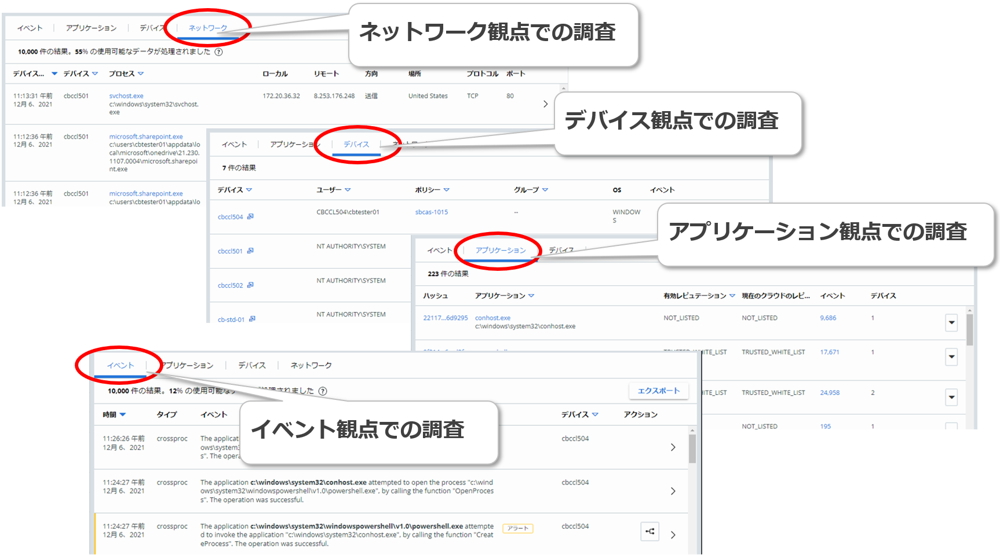

参考資料：
- 調査  
  https://docs.vmware.com/jp/VMware-Carbon-Black-Cloud/services/carbon-black-cloud-user-guide/GUID-164E603A-E45B-4ABC-843B-404A28DC5A7A.html

各タブでは、発生期間や検索クエリ、フィルタ機能を使用して、検索結果を絞り込むことができます。

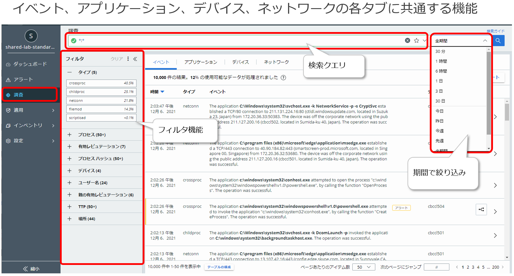

検索クエリでは、単純な値検索だけでなく、検索フィールドを指定や、ワイルドカードを使用することも可能です。

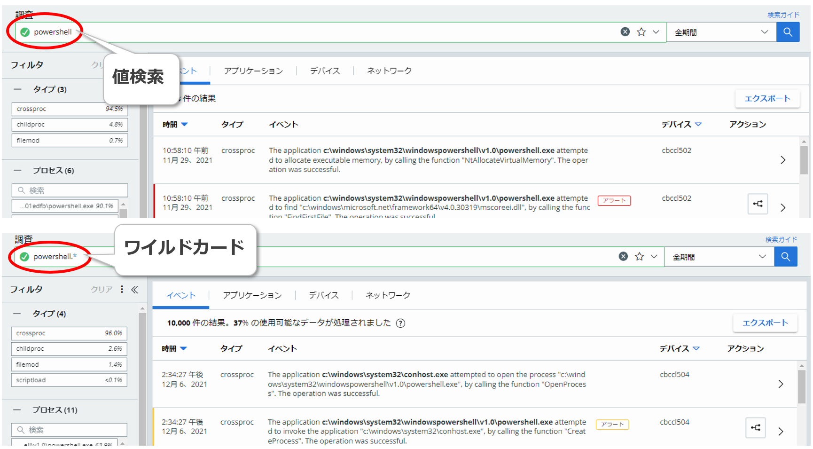

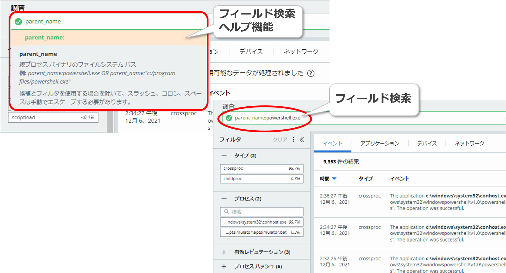

検索クエリで利用できるオプションの詳細については、ページ右上の\[検索ガイド\]リンクをクリックすると確認することが可能です。

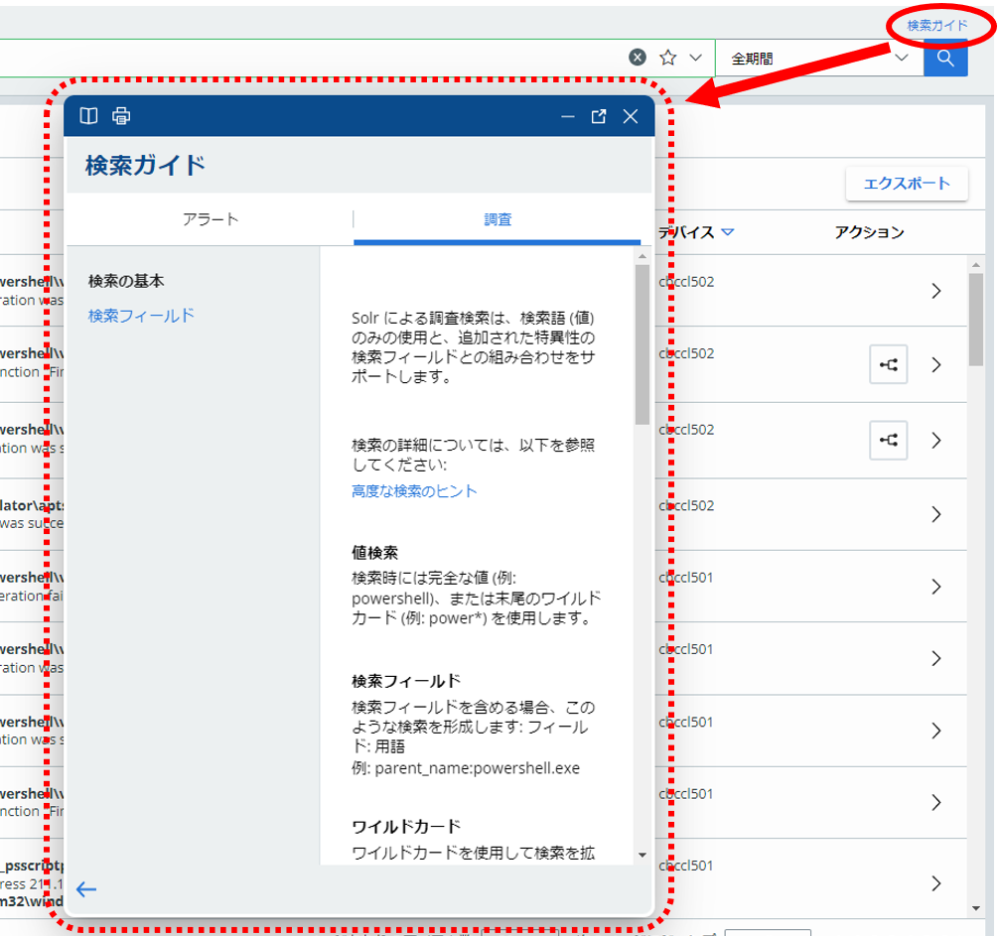

フィルタで利用できる項目については、以下を参照して下さい。

<table>
<colgroup>
<col style="width: 28%" />
<col style="width: 71%" />
</colgroup>
<thead>
<tr class="header">
<th>フィルタ</th>
<th>説明</th>
</tr>
</thead>
<tbody>
<tr class="odd">
<td>タイプ</td>
<td>
以下のイベントのタイプでフィルタ。

・childproc ：子プロセスに関するイベント

・filemod ：ファイルの修正に関するイベント

・netconn ：ネットワーク接続に関するイベント

・crossproc ：クロス処理(他のプロセスに対する操作)に関するイベント

・regmod ：レジストリの修正に関するイベント
</td>
</tr>
<tr class="even">
<td>プロセス</td>
<td>対象となるプロセスのファイルパスでフィルタ。</td>
</tr>
<tr class="odd">
<td>有効レピュテーション</td>
<td>対象となるプロセスに対して有効なレピュテーションでフィルタ。</td>
</tr>
<tr class="even">
<td>プロセス ハッシュ</td>
<td>対象となるプロセスのファイルハッシュでフィルタ</td>
</tr>
<tr class="odd">
<td>デバイス</td>
<td>センサーがインストールされているデバイスのホスト名でフィルタ。</td>
</tr>
<tr class="even">
<td>ユーザー名</td>
<td>エンドポイントのユーザー名でフィルタ。</td>
</tr>
<tr class="odd">
<td>親の有効レピュテーション</td>
<td>親プロセスに対して有効なレピュテーションでフィルタ。</td>
</tr>
<tr class="even">
<td>場所</td>
<td>エンドポイントの通信先の物理ロケーションでフィルタ。</td>
</tr>
</tbody>
</table>

参考資料：
- 調査 - 強化されたイベント  
  https://docs.vmware.com/jp/VMware-Carbon-Black-Cloud/services/carbon-black-cloud-user-guide/GUID-A9A1FD79-AC43-4CAC-B1D8-4B0A69FF8407.html
- EDR: What are the Details Behind the Event Collection Types?  
  https://community.carbonblack.com/t5/Knowledge-Base/EDR-What-are-the-Details-Behind-the-Event-Collection-Types/ta-p/81694

#### 4.2.1.1. イベントの調査

\[イベント\]タブでは、CBセンサーによって収集され、CBCに蓄積されたイベントデータを確認することができます。アラートには含まれないアラート発生前後のイベント等を確認することが可能です。

イベント行右端の\[\>\]をクリックすると、イベントに関連したプロセスとデバイスの情報を確認することができます。

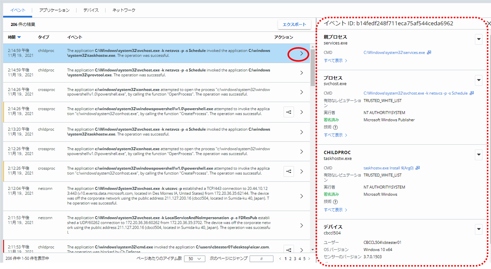

また、アラートに紐づいているイベント行にはトリアージボタンが表示されるので、ここからアラートのトリアージ画面に移動することも可能です。

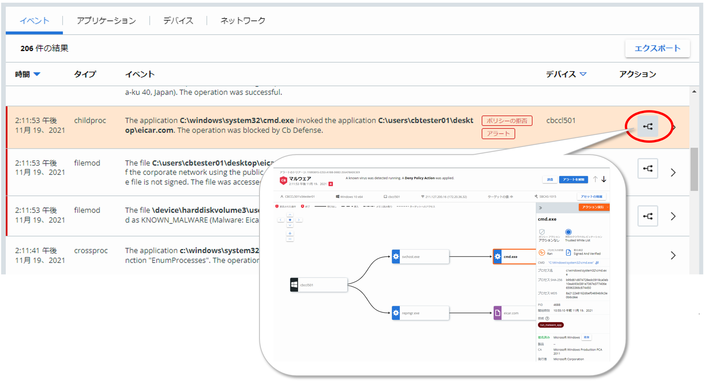

#### 4.2.1.2. アプリケーションの調査

\[アプリケーション\]タブでは、CBセンサーによって収集され、CBCに蓄積されたイベントデータに含まれるアプリケーション情報を調査することができます。

各アプリケーションのフィールドでは、イベント発生当時に有効だった\[有効レピュテーション\]と、\[現在のクラウドレピュテーション\]が確認できます。イベント発生に、なんらかの原因でクラウドレピュテーションが取得できず、クラウドレピュテーションとは異なるレピュテーションで評価された場合、\[有効レピュテーション\]と\[現在のクラウドのレピュテーション\]は異なった値となります。

また、\[イベント\]フィールドと\[デバイス\]フィールドでは、各アプリケーションに関連するイベントとデバイスの数が表示されます。\[イベント\]フィールドは、\[イベント\]タブへのリンクとなっており、クリックすると、そのアプリケーションに関連したイベントのみがフィルター表示されます。

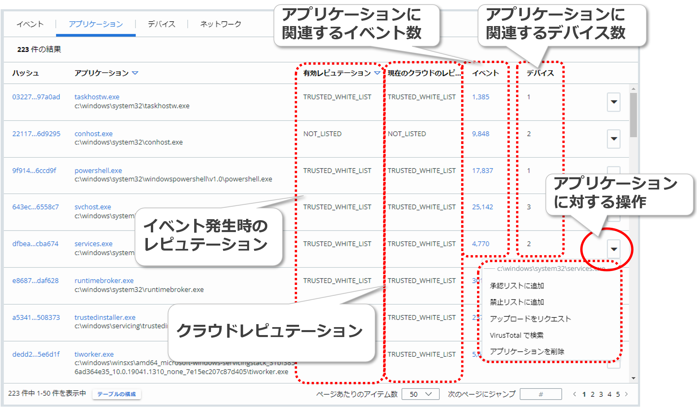

各アプリケーション行の右端の\[▼\]ボタンをクリックすると、そのアプリケーションに対する操作を選択することもできます。これらの操作については、「5.応答（Response）」に記載します。

#### 4.2.1.3. デバイス

\[デバイス\]タブでは、CBセンサーによって収集され、CBCに蓄積されたイベントデータに含まれるデバイス情報を調査することができます。

各デバイスのフィールドでは、そのデバイスにインストールされているCBセンサーの実行アカウント、適用されているポリシー、センサーグループ、エンドポイントのOS等が表示されます。

また、 \[イベント\]フィールドは、\[イベント\]タブへのリンクとなっており、クリックすると、そのデバイスに関連したイベントのみがフィルター表示されます。

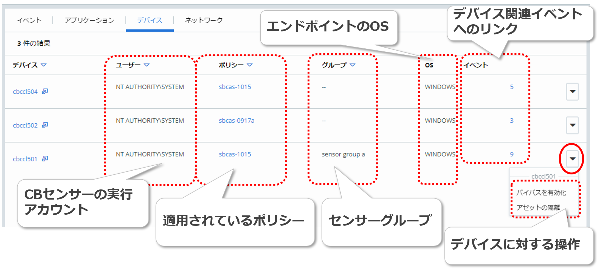

各デバイス行の右端の\[▼\]ボタンをクリックすると、そのデバイスに対する操作を選択することもできます。これらの操作については、「5.応答（Response）」に記載します。

参考資料：
- 調査 - 強化されたイベント - デバイス  
  https://docs.vmware.com/jp/VMware-Carbon-Black-Cloud/services/carbon-black-cloud-user-guide/GUID-A9A1FD79-AC43-4CAC-B1D8-4B0A69FF8407.html>

#### 4.2.1.4. ネットワーク

\[ネットワーク\]タブでは、CBセンサーによって収集され、CBCに蓄積されたイベントデータに含まれるネットワーク通信情報を調査することができます。

各ネットワーク通信のフィールドでは、その通信を行ったデバイス名、プロセス名、通信元アドレス、通信先アドレス、エンドポイントから見た通信の方向、通信先の物理ロケーション、通信に使用されたプロトコルと通信先のポート番号が表示されます。

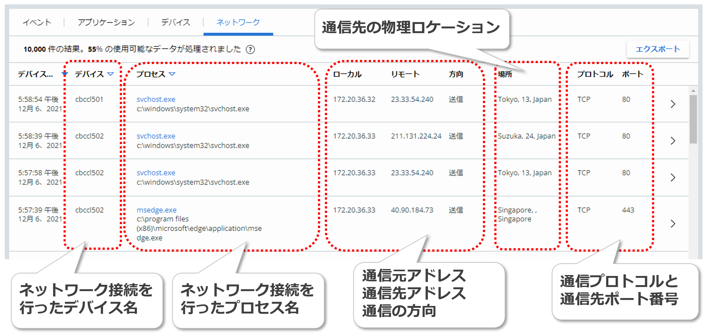

各行右端の\[\>\]をクリックすると、ネットワーク通信情報、それに関連したプロセスとデバイスの情報を確認することができます。

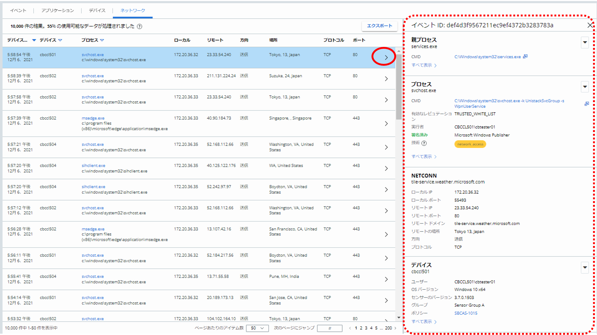

本章では、CBCの持つ脅威の検出機能について取り上げました。次章では、もう1つの重要な機能である応答機能について取り上げます。
