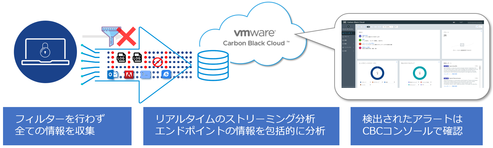
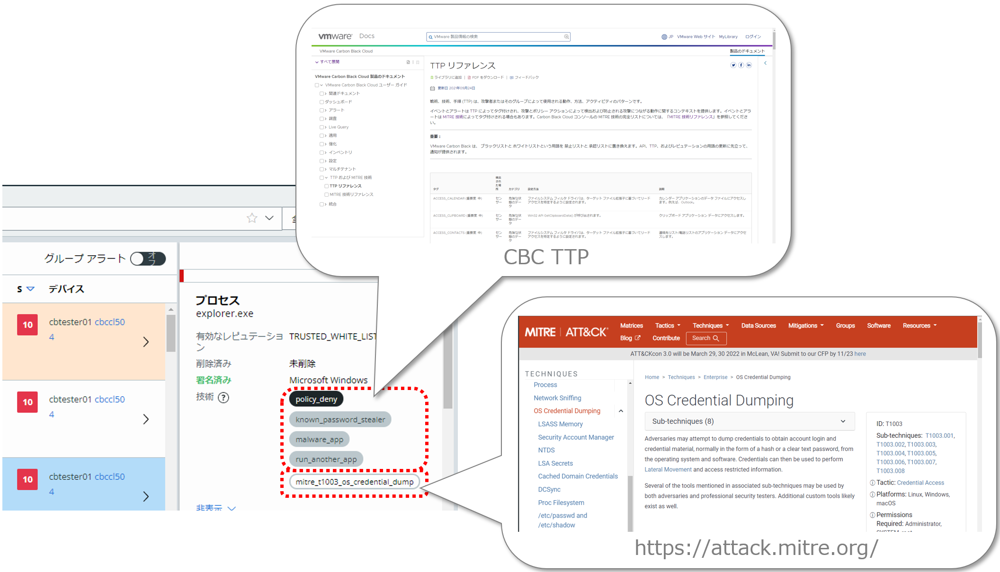

# 4. 検出（Detection）

本章では、CBCが持つ脅威の検出機能について説明します。

CBCでは、疑わしいかどうかに関わらず、CBセンサーをインストールしたエンドポイントから全ての情報を収集します。収集された情報は、リアルタイムでストリーミング分析が行われ、既知の脅威や疑わしい行動を検出するとアラートが出力されます。

収集されたイベントや検出されたアラートは、TTP(戦術、技術、手順)によって、タグ付けされ分類されます。TTPは、CBCによる当該イベントに対する評価や、アラートが出力された理由を確認するために役立ちます。

また、イベントとアラートは、MITRE ATT&CKのTECHNIQUESによってタグ付けされることもあります。CBCによる評価だけでなく、セキュリティ業界で広く利用されているフレームワーク・ナレッジベースを基に、エンドポイントで発生したイベントやアラートを評価することも可能です。

脅威の検出調査までの流れは以下の通りです。

- アラート検出
- アラートのトリアージ
- 調査

次節からは、各項目の詳細な内容について記載します。

* [4.1. アラートのトリアージ](04-1_alaert-triage.md)
* [4-2. 調査](04-2_investigate.md)
