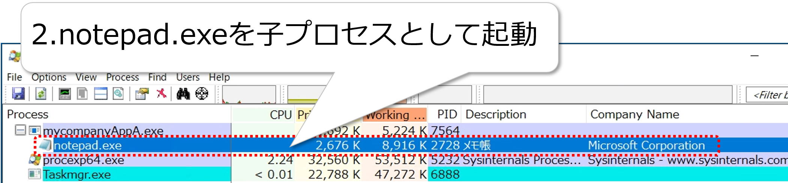

# 5. 応答（Response）

本章では、CBCが検出した脅威に対する応答機能について説明します。

検出された脅威に対して適切な応答処置を行うには、詳細な調査が必要となることが多く、長時間を要する場合があります。

その際に、脅威の発生源となるエンドポイントを放置したままにしておくと、組織全体に脅威が波及してしまう可能性があります。そこで暫定処置として、脅威の発生源であるエンドポイントを隔離して、脅威が組織全体に波及することを防ぎます。

隔離されたエンドポイントは、CBC以外との通信ができなくなりますが、CBCコンソールからはLive Response等の機能を使用して、エンドポイントに対する処置を行うことができます。

処置が完了した時点で、CBCコンソールからエンドポイントの隔離を解除します。

CBCコンソールでは、エンドポイントの隔離やアプリケーションの削除以外にも、承認リストや禁止リストへのファイルハッシュの追加、検体ファイルのアップロードやVirusTotalで検索等のアクションを実行することができます。また、これらのアクションメニューには、前項で紹介したアラートやトリアージ、調査ページからアクセスすることができます。

検出された脅威に対する応答の流れは、以下の通りです。
- 隔離
- 処置（Live Response、悪意のあるアプリケーションの削除）
- 隔離解除
- アラート解除

次節からは、各項目の詳細な内容について記載します。

## 5.1. 隔離

本節では、エンドポイントの隔離操作について記載します。

### 5.1.1. エンドポイントの隔離（アセットの隔離）

アラートが確認したエンドポイントを隔離すると、CBCコンソールへの接続を維持するために使用されるものを除き、すべてのIP/ポートへの着信/発信TCPトラフィックがブロックされます。

WIP:[手順：エンドポイントの隔離]
<!-- (walkthroughs/05-01_endpoint-quarantine.md) -->

また、DNS要求(UDP/53、DHCP UDP/67、UDP/68)を除く、全てのUDP接続もブロックされます。DNS 及びDHCPは、CBCコンソールと隔離されたデバイス間の双方向通信を保証するために許可されます。ARPとICMP(ping)についても、許可されます。

なお、隔離モードで許可および禁止される接続の種類については、カスタマイズすることはできません。

参考資料：
- アラートでのアクション実行／アラートによりトリガされたデバイスの隔離  
  https://docs.vmware.com/jp/VMware-Carbon-Black-Cloud/services/carbon-black-cloud-user-guide/GUID-C8769B0F-5184-4028-B915-56AFFE315989.html
- Endpoint Standard: What happens when a Device is placed in Quarantine?  
  https://community.carbonblack.com/t5/Knowledge-Base/Endpoint-Standard-What-happens-when-a-Device-is-placed-in/ta-p/71741

## 5.2. Live Response

Live Responseとは、CBセンサーがインストールされているエンドポイントをCBCコンソールから遠隔操作することが可能なCUIツールです。

Live Responseを使用するには、エンドポイントに適用するポリシーでLive Responseを有効化する必要があります。

> ポリシーでLive Responseを有効化する手順については、「3.1.3.ポリシーの作成」を参照。

Live Responseが有効になると、\[インベントリ\] - \[エンドポイント\]のアクションフィールドにLive Responseボタンが表示されます。

Live Responseボタンをクリックすることで、そのエンドポイントへのLive Responseを開始することができます。

参考資料：
- Live Response の使用  
  https://docs.vmware.com/jp/VMware-Carbon-Black-Cloud/services/carbon-black-cloud-user-guide/GUID-7399B083-D65C-40ED-A831-460F7216F748.html

### 5.2.1. Live Responseコマンド

helpコマンドを実行することで、利用可能なコマンド一覧を確認することが可能です。

各コマンドのヘルプを参照するには、help \[コマンド名\]と入力します。

例えば、regコマンドのヘルプを参照するには、以下のように入力します。

特定のプロセスを実行して、標準およびエラー出力をLive Responseコンソールに返すには、execfg \[実行プロセス名\]と入力します。

例えば、repcliコマンドを実行して、出力結果をLive Responseコンソールに表示するには、以下のように入力します。

利用可能なコマンドについての詳細は、helpコマンドと以下の参考資料を参照して下さい。

参考資料：
- Live Response コマンド  
  https://docs.vmware.com/jp/VMware-Carbon-Black-Cloud/services/carbon-black-cloud-user-guide/GUID-DED51138-E9A8-4BCC-873E-5768DAB596BE.html?hWord=N4IghgNiBcIQlgNwKYAIBOyDOAHA9gHZbIgC+QA

### 5.2.2. Live Responseの操作

Live Responseを使用すると、隔離されたエンドポイントに接続して実機調査できます。

WIP:[手順：Live Responseの操作]
<!-- (walkthroughs/05-01_live-response.md) -->

Live Responseで利用可能なコマンドには、レジストリの変更やメモリダンプの取得等、様々なコマンドが用意されていますので、幅広い用途に応用することが可能です。

## 5.3. アプリケーション削除

前章の「4.1.3.3.アラートの確認」において、アラートの確認を行った際に、\[復旧\]項目からアラートに関連するデバイスやファイルに対する応答操作が可能である事を確認した事を思い出して下さい。

デバイスに対する応答操作については、前節までの「5.1.隔離」と「5.2.Live Response」で確認してきた内容になります。

本節では、アプリケーションの削除操作等のアラート関連ファイルに対する操作について記載します。

### 5.3.1. マルウェアファイルの評価

「4.1.3.3.アラートの確認」においては、マルウェアファイルや正規ファイルの評価の指標として、レピュテーションや署名、ハッシュ値等を使用することを解説しました。

更にファイルの評価精度を高めるために、代表的なセキュリティーベンダーのひとつであるVitusTotalの評価も併せて確認できます。

WIP:[手順：マルウェアの確認]
<!-- (walkthroughs/05-01_malware-check.md) -->

### 5.3.2. マルウェアファイルの削除

マルウェアファイルの評価が確定したら、エンドポイントからマルウェアファイルを削除します。

WIP:[手順：マルウェアファイルの削除]
<!-- walkthroughs/05-01_malware-remove.md) -->

アラートページの他に、トリアージページやイベントページからでも、マルウェアファイルの削除を実施できます。

## 5.4. 隔離解除

前節でエンドポイントからマルウェアファイルを削除して、アラートの原因となった脅威が解消されました。

本節では、脅威が解消されたエンドポイントの隔離解除操作について記載します。

### 5.4.1. エンドポイントの隔離解除（アセットの隔離解除）

ここでは、「5.3.2.マルウェアファイルの削除」からの操作の流れに沿って、エンドポイントページで操作する手順を紹介しますが、状況に合わせて、アラートページや、トリアージページ、イベントページからも実施することが可能です。

WIP:[手順：エンドポイントの隔離解除]
<!-- (walkthroughs/05-01_endpoint-unquarantine.md) -->

## 5.5. アラートの解除

これまでに、アラートの原因を調査して、その原因を取り除くことで、アラートへの対応は完了しました。

対応が完了したアラートについては解除を行います。

WOP: [手順：アラートの解除]
<!-- (walkthroughs/05-01_alart-reset.md) -->

参考資料：
- アラートの解除  
  https://docs.vmware.com/jp/VMware-Carbon-Black-Cloud/services/carbon-black-cloud-user-guide/GUID-A6EB61A4-48CB-47EA-AEDC-0B992984E37F.html

アラートの検出から応答までの流れは一通り解説しました。

## 5.6. 過検知対応

組織で利用している正規のアプリケーションであっても、その動作の仕組みによっては、CBによって脅威として過検知されてしまう場合があります。

このような場合、アプリケーションファイルのハッシュ値をレピュテーションの承認リストに追加することで、CBによる過検知を回避することができます。

本項では、サンプルアプリを過検知されてしまう業務用アプリに見立て、ハッシュ値を承認リストに追加することで過検知を回避する手順を紹介します。

### 5.6.1. サンプルアプリについて

本項で使用するサンプルアプリは、実行ファイルmycompanyAppA.exeとmycompanyMod.dllの2つのファイルで構成されています。サンプルサプリの動作の流れは以下の通りです。

1. mycompanyAppA.exeを実行します。

2. mycompanyAppA.exeプロセスはWindowsの正規ファイルnotepad.exeを子プロセスとして起動します。

3. notepad.exeプロセスのスレッドとしてmycompanyMod.dllをロードします(dllインジェクション)。mycompany.dllはメッセージボックスを表示するだけで、悪意のあるペイロードは含まれていません。

notepad.exeにインジェクションされるmycompanyMod.dllが実行する処理自体は無害ですが、CBでは他のプロセスの仮想メモリ領域にdllインジェクションを実行する動作が脅威として検知されます。

### 5.6.2. 過検知アラートの確認

「5.6.1.サンプルアプリについて」の内容を踏まえ、サンプルアプリの動作がどのようなアラートとなって検出されるのか確認します。

WIP:[手順：過検知アラートの確認]
<!-- (walkthroughs/05-01_alart-false-positive-1.md) -->

### 5.6.3. 承認リストへの追加

実行する処理が無害であることが確認済みで、CBによって過検知される原因が判明したものについては、承認リストへの追加により検知対象から除外できます。
本項では、サンプルアプリをレピュテーションの承認リストに追加して、過検知されなくする手順について記載します。

WIP:[手順：過検知対象の承認リストへの追加]
<!-- (walkthroughs/05-01_alart-false-positive-2.md) -->
