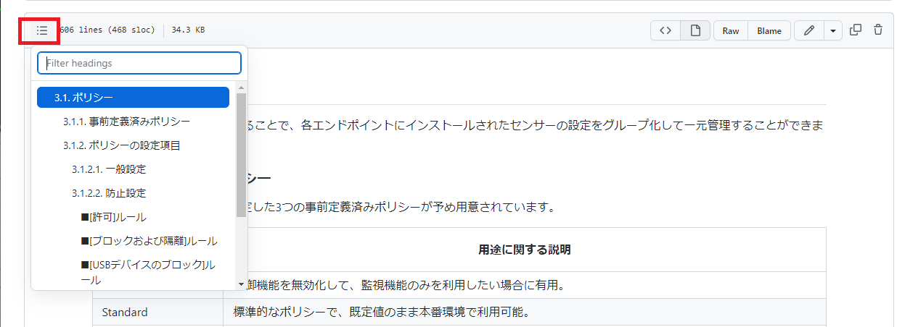

# Carbon Black Cloud Note - Rev 2.0

---

## 目次

* [1. はじめに](/01_intro.md)
* [2. Carbon Black Cloudコンソールへのログイン](/02_cloud-login.md)
* [3. 導入と防御](/03_impl_and_protect.md)
* [4. 検出（Detection）](/04_detection.md)
* [5. 応答（Response）](/05_response.md)

各ページでは、下記のようにボタンをクリックすることで見出しを表示できます。

---

## 参考文献

* VMware Carbon Black Cloud のドキュメント
  - https://docs.vmware.com/jp/VMware-Carbon-Black-Cloud/index.html

## 更新履歴

| 更新日     | 更新内容 |
|---         |--- |
| 2022/02/15 | 初版 |
| 2022/08/20 | Rev 2.0 むけドラフト作成 |
| 2022/11/24 | Git管理に移行 |
| 2023/01/26 | GitHubに公開 |

---
