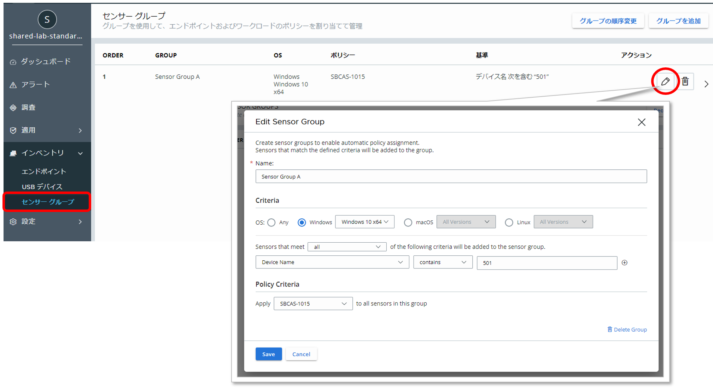
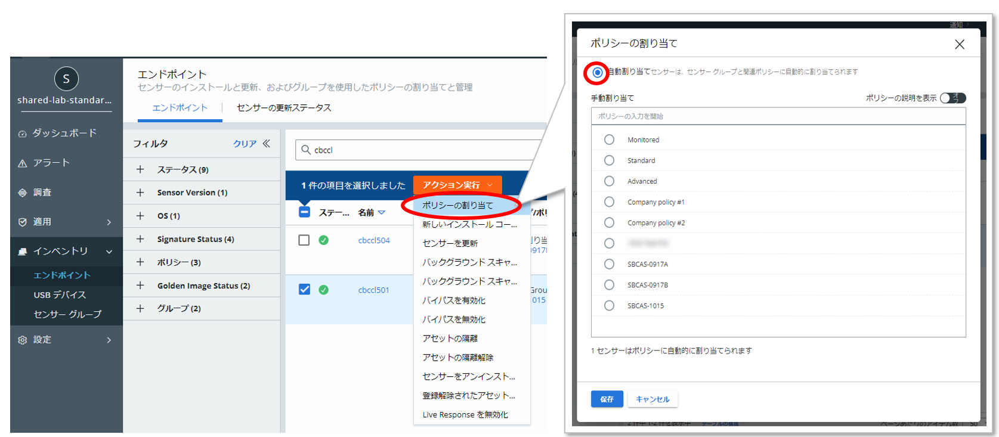

## 参考 5：センサーグループについて

本書では、詳しく取り扱いませんが、指定した条件に合致するセンサーを集約する「センサーグループ」と呼ばれるグループ作成して、予めポリシーを割り当ておくことも可能です。

センサーへのポリシー割り当てを自動割り当てにしておくことで、センサーグループに所属するセンサーに対して、センサーグループに割り当てておいたポリシーを自動適用させることが可能です。

