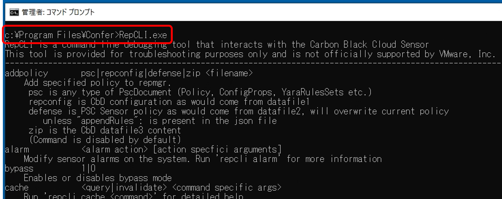
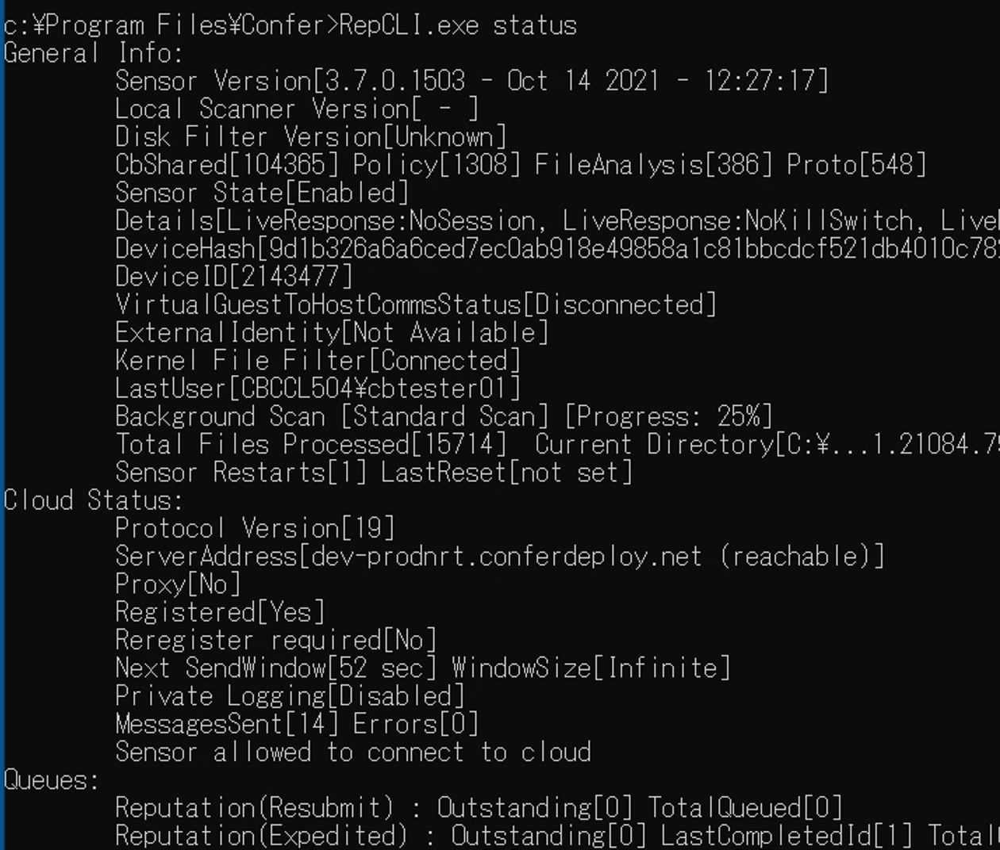
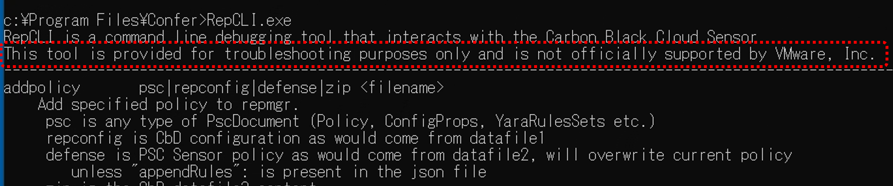

## 参考 6：RepCLIコマンドについて

RepCLIコマンドとは、CBセンサーと一緒にインストールされるRepCLIユーティリティで使用可能なコマンドセットです。エンドポイントにおいてRepCLIコマンドを使用することで、インストールされたCBセンサーを管理することが可能になります。

RepCLIコマンドを利用するには、C:\Program Files\Confer\RepCLI.exeを実行します。

パラメータ無でRepCLI.exeを実行すると、利用可能なコマンドの一覧と説明を確認することができます。

例えば、RepCLI.exe statusを実行すると、CBセンサーの状態を確認することができます。

大変多くのコマンドを含んでいるRepCLI.exeですが、この中の一部のコマンドについては、利用する際に認証が必要とされます。

この認証に対する許可ユーザーやグループを設定するのが、Unattended installのコマンドラインで指定するCLI_USER=\[ユーザー／グループSID\] パラメータになります。

CLI_USERで指定されたユーザーやグループは、RepCLI.exeの全てのコマンドにアクセス可能になります。

なお、RepCLI.exeは、トラブルシューティングの目的でのみ提供されており、VMware社による正式サポートはされていませんので、使用する際には、この点も併せて認識しておく必要があります。

