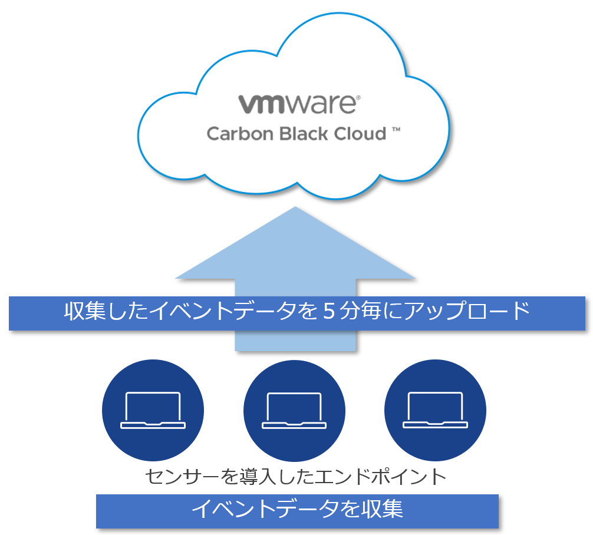

## 参考 7：CBセンサーによるイベントデータのアップロード間隔について

CBセンサーのインストールが完了すると、CBセンサーはエンドポイントのイベントデータを5分間隔でクラウドにアップロードし始めます。

エンドポイントがクラウドに接続できない場合でも、CBセンサーはイベントデータの収集を続行して、最大100MBのデータ(数時間～数日分)をエンドポイントのローカルに保存します。クラウドへの接続が回復すると、CBセンサーはローカルにキャッシュされた古いイベントから直近のイベントに向かってアップロードを再開します。

参考資料：
- Cb Defense: Offline versus Off-Prem Sensors  
  https://community.carbonblack.com/t5/Knowledge-Base/Cb-Defense-Offline-versus-Off-Prem-Sensors/ta-p/44574
