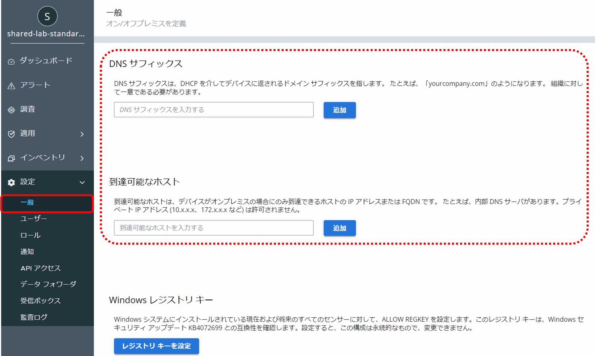

## 参考 10：CBセンサーによるオンプレミスとオフプレミス判定について

\[設定\]ページの\[一般\] - \[DNSサフィックス\]と\[到達可能なホスト\]の２つの設定において、CBセンサーがエンドポイントのローケーションがオンプレミスかオフプレミスかを判断する条件を指定することができます。

例えば、オンプレミスのDHCPサーバのサーバオプションやスコープオプションを使用して、オンプレミスネットワークに接続されたエンドポイントのNICに組織のDNSサフィックスを自動設定している場合、\[設定\]ページの\[一般\] - \[DNSサフィックス\]欄に同じ組織のDNSサフィックスを入力しておくことで、オンプレミスネットワークに接続されたエンドポイントを識別することが可能になります。

また、\[設定\]ページの\[一般\] - \[到達可能なホスト\]欄には、オンプレミスからのみ到達可能なノードのFQDNやIPアドレスを指定しておくことで、CBセンサーがそのノード宛にpingを実行し、到達可能であれば、オンプレミスであると判断します。

ただし、プライベートアドレス等の汎用性のあるアドレスを指定してしまうと、自宅や外出先等のオフプレミス環境であってもオンプレミスであるとご認識されてしまう可能性がありますので、例えば、組織内からのみアクセス可能なDNSサーバのFQDN等、ユニークな情報を登録する必要があります。

参考資料：
- Cb Defense: On-Prem versus Off-Prem Sensors  
  https://community.carbonblack.com/t5/Knowledge-Base/Cb-Defense-On-Prem-versus-Off-Prem-Sensors/ta-p/40062
- Cb Defense: Offline versus Off-Prem Sensors  
  https://community.carbonblack.com/t5/Knowledge-Base/Cb-Defense-Offline-versus-Off-Prem-Sensors/ta-p/44574
