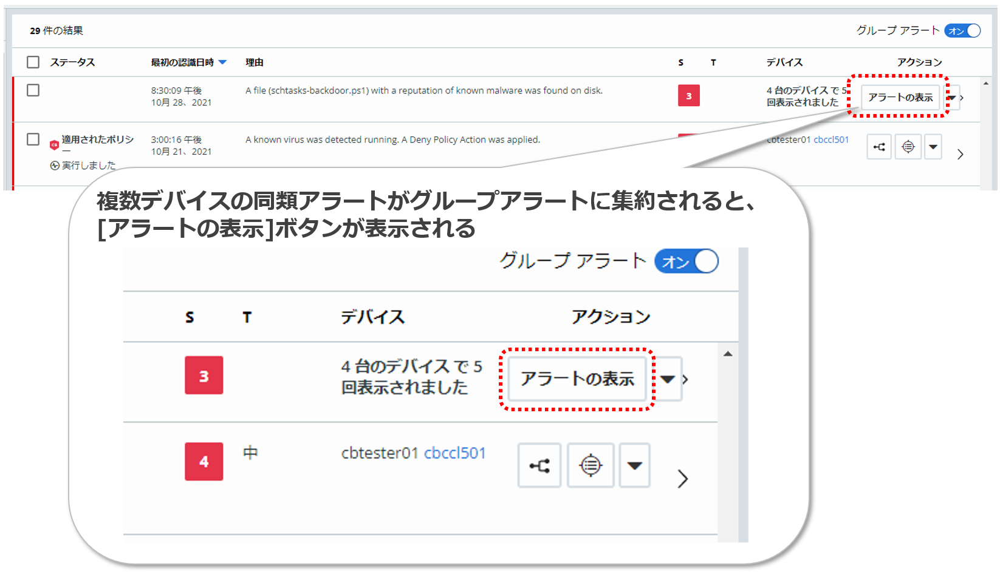
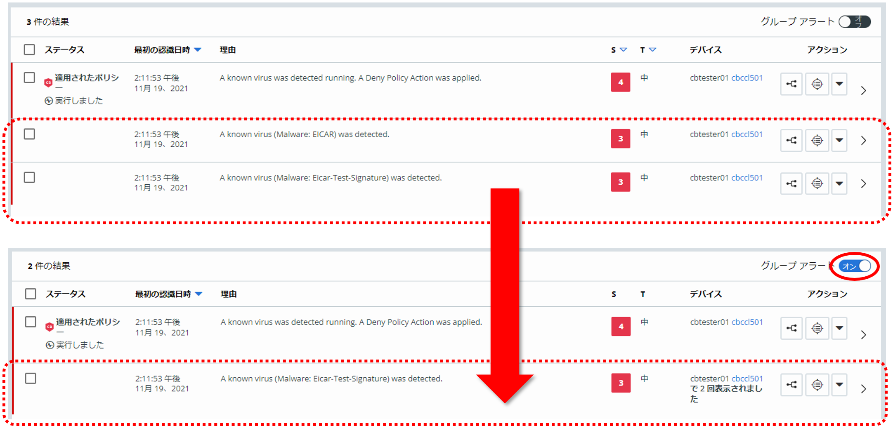
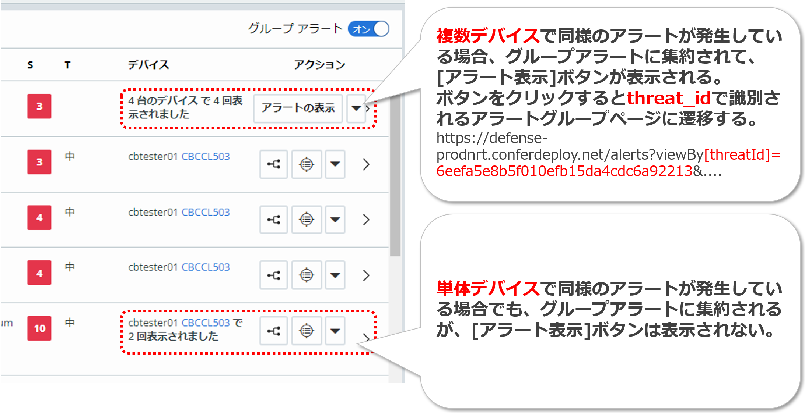

## 参考 11：グループアラートについて

複数のエンドポイントで同様のアラートが発生する場合があります。グループアラートとは、この様なアラートを単一のアラートとしてグループ化して、ThreatIdと呼ばれる新たなIDを付与して識別できるようにする機能です。複数のデバイスにまたがって、組織全体で頻繁に発生しているアラートを取り扱う際に、有用な機能となります。

グループアラートを有効にするには、アラートページ右上の\[グループ アラート\]スイッチをオンに設定します。逆に、デバイス毎のアラート表示に戻したい場合には、\[グループ アラート\]スイッチをオフに設定します。このオン／オフはいつでも切り替えられます。

複数デバイスの同類アラートがグループアラートに集約されると、グループアラート行には、\[アラートの表示\]ボタンが表示されます。

\[アラート表示\]ボタンをクリックすると、グループ化された個別アラートの一覧がフィルタ表示されます。

なお、「4.1.4.2.トリアージの実践」の最後で実施したように、グループアラートをオンにすると、複数のデバイスに限らず、同一のエンドポイントで発生した同様のアラートについてもグループ化されます。

ただし、同じデバイスで発生した同類アラートだけをグループ化したグループアラートには、\[アラートの表示\]ボタンは表示されず、threatIdも付与されません。

参考資料：
- グループアラート  
  https://docs.vmware.com/en/VMware-Carbon-Black-Cloud/services/carbon-black-cloud-user-guide/GUID-7AE51D2D-0DAD-43E5-BE01-D664B4BD8C0A.html
- アラート ID、イベント ID、および脅威 ID  
  https://docs.vmware.com/jp/VMware-Carbon-Black-Cloud/services/carbon-black-cloud-user-guide/GUID-5D9EA7FC-4C46-4B6D-8D2B-467651EF1F28.html
- Endpoint Standard: Event ID vs Alert ID vs Threat ID  
  https://community.carbonblack.com/t5/Knowledge-Base/Endpoint-Standard-Event-ID-vs-Alert-ID-vs-Threat-ID/ta-p/42859
- Cb Defense: What Does Dismissing a Group of Alerts do?  
  https://community.carbonblack.com/t5/Knowledge-Base/Cb-Defense-What-Does-Dismissing-a-Group-of-Alerts-do/ta-p/87256
